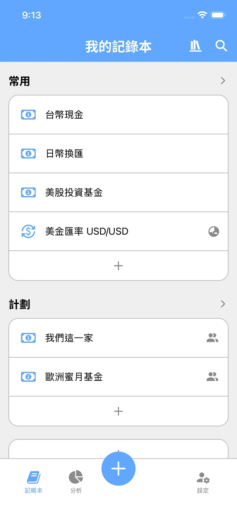
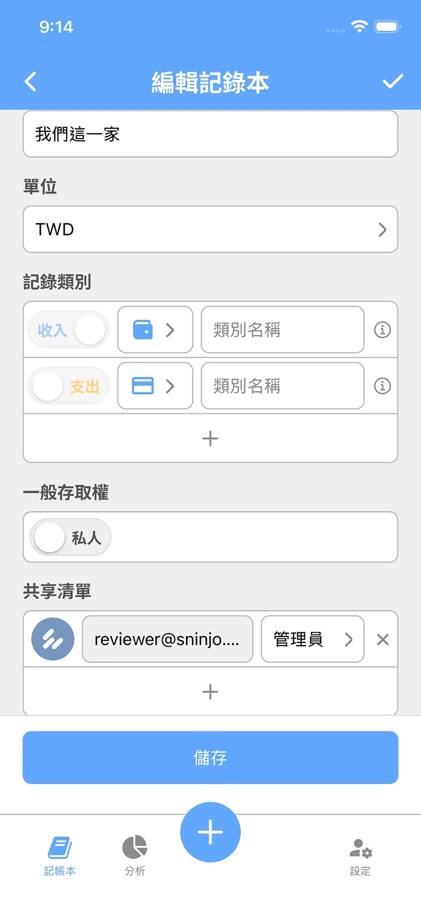
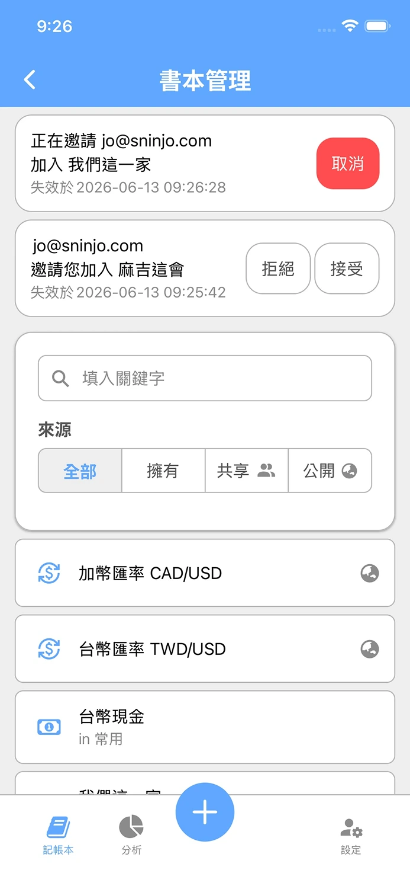

## 摘要

開發日期: 6/01 - 6/14  
與會人員: Jo (獨立開發)  
會議規劃:

- 站會: 每天早上 8.
- PBR: 不進行
- Sprint Planning: 6/01 (一) 8.
- Sprint Review: 6/12 (五) 8.
- Sprint Retro: 6/12 (五) 8.

## PBR 會議

N/A

## Planning 會議

目標:

1. ✅ 自動化同步貨幣匯率
2. ❌ 優化 Category (類別) 的 UX
3. ✅ 重構 Backend 模組結構
4. ✅ 開發記錄本權限管理 (共享、公開權限)
5. ❌ 開發 Google Drive 自動備份
6. ❌ 加入前端自動化測試 (website, app)

目標達成率: 50%

## Review 會議

DEMO:

1. 「我的記錄本」頁面可以檢視所有訂閱的書本，並標注「共享」與「公開」
2. 「編輯記錄本」頁面加入「一般存取權」與「共享清單」
3. 新增「書本管理」頁面，提供管理書本訂閱與共享邀請

<ImageCarousel>

</ImageCarousel>

雙平台皆釋出 Keeper 最新版本 v1.1.0，使用者可以透過 App Store 或 Google Play 下載更新，體驗新的版本內容

## Retro 會議

1. 目標完成率只有 50%  
   A. 下個 Sprint 導入 Story Point 計算機制，評估每個任務的開發時長，以此控制每個 Sprint 的任務量

2. 同時間實作多個目標，延長任務完成時間  
   A. 下個 Sprint 每次只針對一個目標進行衝刺，或至少要切換 Branch，確保開發與測試流程不受其他任務影響

3. Mobile 手動測試花太多時間，造成其他任務延遲  
   A. 6/12 - 6/14 將進行前端 (website & mobile) 自動化測試的開發，預計可以縮短 30-40% 的手動測試時間

4. App 上架流程不嫻熟，造成其他任務延遲  
   A. 下個 Sprint 的安排任務量應加入考量 App 上架流程的預留時間，可視流程嫻熟程度調整

5. 某幾天 DEV 任務太滿，造成 MKT 項目沒有完成  
   A. 列入觀察項目，上述問題改善後，應可改善 DEV 任務過重問題

## 站會記錄

記錄細節

### 2026-06-14 (Day 14)

昨天完成什麼

- DEV
  - 開啟 App v1.1 強制更新
- MKT
  - Threads 發布 工作室日記 與 自我介紹 貼文
  - Threads 去其他新貼文互動

今天要做什麼

- DEV
  - 將公開記錄本公開
  - 撰寫 App 單元測試
- MKT
  - Threads 發布 工作室日記 貼文
  - Threads 去其他新貼文互動

有遇到什麼困難

- Play Store 需要 12 個 Tester 在 Google 封閉測試環境使用 14 天才能上架... (5/12)

### 2026-06-13 (Day 13)

昨天完成什麼

- DEV
  - 上架 App Store & Google Store
  - 開發已移除資料的回收機制
  - 修復後端 Test Coverage 計算衝突問題
  - 規劃 App 自動測試套件
- MKT
  - Threads 發布 工作室日記 與 AllIsWell 貼文
  - Threads 去其他新貼文互動
  - IG, Threads 發布 Keeper v1.1 貼文

今天要做什麼

- DEV
  - 開啟 App v1.1 強制更新
  - 撰寫 App 單元測試
- MKT
  - Threads 發布 工作室日記 與 AllIsWell 貼文
  - Threads 去其他新貼文互動

有遇到什麼困難

- Play Store 需要 12 個 Tester 在 Google 封閉測試環境使用 14 天才能上架... (5/12)

### 2026-06-12 (Day 12)

N/A

### 2026-06-11 (Day 11)

昨天完成什麼

- DEV
  - 開發記錄本權限功能的前端 UI 與串接 API
- MKT
  - Threads 發布 工作室日記站會 的貼文

今天要做什麼

- DEV
  - 檢查 Book 頁面上捲後 header 按鈕失效的原因
  - 打包 App 後進行手動測試
  - App Store & Google Store 送審
- MKT
  - Threads 發布 工作室日記站會 與 AllIsWell 的貼文
  - Threads 去其他新貼文互動
  - LinkedIn 發布 AllIsWell 文章

有遇到什麼困難

- 暫緩「優化 Category (類別) 的 UX」，需要更詳細的功能設計
- Play Store 需要 12 個 Tester 在 Google 封閉測試環境使用 14 天才能上架... (5/12)

### 2026-06-10 (Day 10)

昨天完成什麼

- DEV
  - 優化前端元件，使其可以套用至新的功能上
  - 修正後端 API 格式
  - 設計記錄本權限功能的前端 UI
- MKT
  - Threads 發布 工作室日記站會 的貼文
  - Threads 去其他新貼文互動

今天要做什麼

- DEV
  - 開發記錄本權限功能的前端 UI 與串接 API
  - 檢查 Book 頁面上捲後 header 按鈕失效的原因
  - 送審 App Store
- MKT
  - Threads 發布工作室日記站會的貼文
  - Threads 去其他新貼文互動

有遇到什麼困難

- 暫緩「優化 Category (類別) 的 UX」，需要更詳細的功能設計
- Play Store 需要 12 個 Tester 在 Google 封閉測試環境使用 14 天才能上架... (5/12)

### 2026-06-09 (Day 9)

昨天完成什麼

- DEV
  - 開發記錄本權限功能後端 API (撰寫 E2E 測試、DB Migration)
  - 依照使用者回饋優化 App
    1. 部分文案修正
    2. Category Sheet 加上編輯連結
    3. 延長所有資料 name 的長度至 50 字元
- MKT
  - Threads 發布 工作室日記站會 與 獨立開發 的貼文
  - Threads 去其他新貼文互動

今天要做什麼

- DEV
  - 設計與開發記錄本權限功能前端 UI 與串接 API
  - 檢查 Book 頁面上捲後 header 按鈕失效的原因
- MKT
  - Threads 發布工作室日記站會的貼文
  - Threads 去其他新貼文互動

有遇到什麼困難

- 暫緩「優化 Category (類別) 的 UX」，需要更詳細的功能設計
- Play Store 需要 12 個 Tester 在 Google 封閉測試環境使用 14 天才能上架... (5/12)

### 2026-06-08 (Day 8)

昨天完成什麼

- DEV
  - 開發記錄本權限功能後端 API (Service 與 Handler)
    1. 撰寫 Service 的 Unit Test
    2. 調整 Handler 內容與測試
- MKT
  - Threads 發布 工作室日記站會, 獨立開發 與 個人財務 的貼文
  - Threads 去其他新貼文互動

今天要做什麼

- DEV
  - 開發記錄本權限功能後端 API (撰寫 E2E 測試)
  - 設計與開發記錄本權限功能前端 UI 與串接 API
- MKT
  - Threads 發布工作室日記站會的貼文
  - Threads 去其他新貼文互動

有遇到什麼困難

- 暫緩「優化 Category (類別) 的 UX」，需要更詳細的功能設計
- Play Store 需要 12 個 Tester 在 Google 封閉測試環境使用 14 天才能上架... (5/12)

### 2026-06-07 (Day 7)

昨天完成什麼

- DEV
  - 開發記錄本權限功能後端 API (Service 的 Unit Test 60%)
- MKT
  - Threads 發布 工作室日記站會 的貼文

今天要做什麼

- DEV
  - 開發記錄本權限功能後端 API (Service 與 Handler)
    1. 撰寫 Service 的 Unit Test
    2. 調整 Handler 內容與測試
    3. 撰寫 E2E 測試
- MKT
  - Threads 發布工作室日記站會的貼文
  - Threads 去其他新貼文互動

有遇到什麼困難

- 記錄本權限的情境蠻複雜且牽涉層面廣，需要再花時間檢查
- 暫緩「優化 Category (類別) 的 UX」，需要更詳細的功能設計
- Play Store 需要 12 個 Tester 在 Google 封閉測試環境使用 14 天才能上架... (4/12)

### 2026-06-06 (Day 6)

昨天完成什麼

- DEV
  - 開發記錄本權限功能後端 API (Service)
- MKT
  - Threads 發布 工作室日記站會 的貼文

今天要做什麼

- DEV
  - 開發記錄本權限功能後端 API (Service 與 Handler)
    1. 撰寫 Service 的 Unit Test
    2. 調整 Handler 內容與測試
    3. 撰寫 E2E 測試
- MKT
  - Threads 發布工作室日記站會的貼文
  - Threads 去其他新貼文互動

有遇到什麼困難

- 記錄本權限的情境蠻複雜且牽涉成面廣，需要再花時間檢查
- 暫緩「優化 Category (類別) 的 UX」，需要更詳細的功能設計
- Play Store 需要 12 個 Tester 在 Google 封閉測試環境使用 14 天才能上架... (4/12)

### 2026-06-05 (Day 5)

昨天完成什麼

- DEV
  - 開發記錄本權限功能後端 API (Repository 與 Database Schema)
- MKT
  - Threads 發布 工作室日記站會 與 獨立開發 的貼文
  - Threads 去其他新貼文互動

今天要做什麼

- DEV
  - 開發記錄本權限功能後端 API (Service 與 Handler)
  - 設計 APP 記錄本權限功能的頁面
- MKT
  - Threads 發布工作室日記站會的貼文
  - Threads 去其他新貼文互動

有遇到什麼困難

- Play Store 需要 12 個 Tester 在 Google 封閉測試環境使用 14 天才能上架... (4/12)
- 暫緩「優化 Category (類別) 的 UX」，需要更詳細的功能設計

### 2026-06-04 (Day 4)

昨天完成什麼

- DEV
  - 檢查貨幣匯率自動同步狀況
  - 補上 E2E 測試重構
  - 設計記錄本權限功能的 User Story, API Spec 與 Database Schema
- MKT
  - Threads 發布 工作室日記站會 與 獨立開發 的貼文
  - Threads 去其他新貼文互動

今天要做什麼

- DEV
  - 開發記錄本權限功能後端 API
  - 設計 APP 記錄本權限功能的頁面
- MKT
  - Threads 發布工作室日記站會的貼文
  - Threads 去其他新貼文互動

有遇到什麼困難

- Play Store 需要 12 個 Tester 在 Google 封閉測試環境使用 14 天才能上架... (4/12)
- 暫緩「優化 Category (類別) 的 UX」，需要更詳細的功能設計

### 2026-06-03 (Day 3)

昨天完成什麼

- DEV
  - 完成 Backend 模組重構
- MKT
  - Threads 發布工作室日記 Sprint Planning 與站會的貼文
  - Threads 去其他新貼文互動

今天要做什麼

- DEV
  - 檢查貨幣匯率自動同步狀況
  - 設計與開發記錄本權限功能 (共享、公開)
- MKT
  - Threads 發布工作室日記站會的貼文
  - Threads 去其他新貼文互動

有遇到什麼困難

- Play Store 需要 12 個 Tester 在 Google 封閉測試環境使用 14 天才能上架... (4/12)
- 暫緩「優化 Category (類別) 的 UX」，需要更詳細的功能設計

### 2026-06-02 (Day 2)

昨天完成什麼

- DEV
  - Google Workspace 修復信件頭像無法顯示的問題
  - 自動化同步貨幣匯率
  - 規劃 Backend 模組重構方式，且逐步拆解模組
- MKT
  - Threads 發布工作室日記 Sprint Planning 與站會的貼文
  - Threads 去其他新貼文互動

今天要做什麼

- DEV
  - 檢查貨幣匯率自動同步狀況
  - 完成 Backend 模組重構
  - 設計與開發記錄本權限功能 (共享、公開)
- MKT
  - Threads 發布工作室日記站會的貼文
  - Threads 去其他新貼文互動

有遇到什麼困難

- Play Store 需要 12 個 Tester 在 Google 封閉測試環境使用 14 天才能上架... (4/12)
- 暫緩「優化 Category (類別) 的 UX」，需要更詳細的功能設計

### 2026-06-01 (Day 1)

昨天我完成了什麼

- DEV
  - Google Workspace 購買 & 配置，Email 正常運作，但頭像异常
  - Keeper 上架至 App Store
  - 官網補上 Keeper 的 App Store 與 Play Store 的下載連結
  - 官網加上「問題回報」頁面，並測試 Google Form 正常運作且開啟 Email 通知
- MKT
  - IG 發布 Keeper 上架的文章
  - Threads 發布 工作室日記 Sprint 1 的貼文

今天我要做什麼

- DEV
  - Google Workspace 確認信件的頭像問題
  - 自動化同步貨幣匯率
  - 優化 Category (類別) 的 UX
  - 規劃 Backend 模組重構方式
- MKT
  - Threads 發布 Sprint Planning 與站會的貼文
  - Threads 去其他新貼文互動

有遇到什麼困難

- Play Store 需要 12 個 Tester 在 Google 封閉測試環境使用 14 天才能上架... (3/12)

