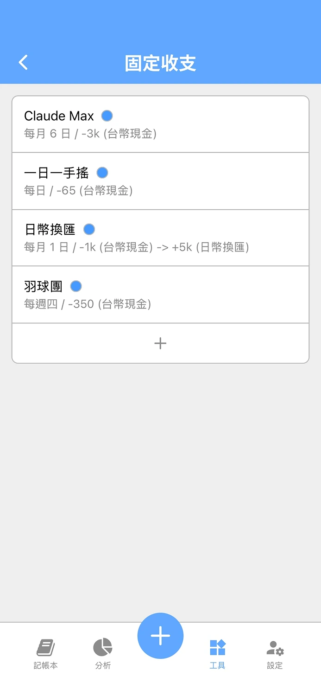
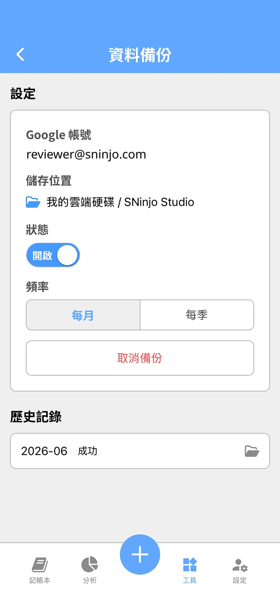
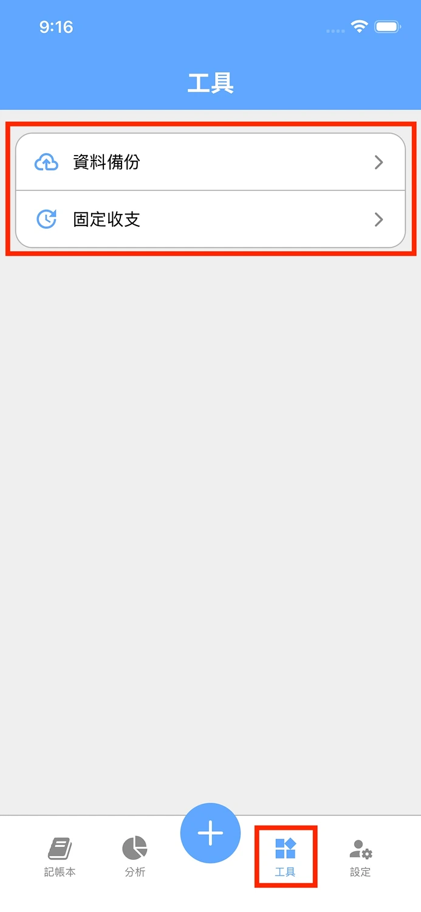

## 摘要

開發日期: 6/15 - 6/28
與會人員: Jo (獨立開發)
會議規劃:

- 站會: 每天早上 8.
- PBR: 6/11 (四) - 6/14 (日)
- Sprint Planning: 6/15 (一) 8.
- Sprint Review: 6/26 (五) 8.
- Sprint Retro: 6/26 (五) 8.

## PBR 會議

Threads 貼文的投票結果：

- [0 票] 資料定期備份至 Google Drive
- [0 票] 雲端發票同步
- [1 票] 固定支出/ 收入管理

## Planning 會議

目標：

- ✅ [SP: 5] 固定支出/ 收入管理
- ✅ [SP: 8] Google Drive 自動備份
- ❌ [SP: 3] 當日匯率檢視
- ❌ [SP: 3] App 元件 UX 優化

共完成 13 SP

## Review 會議

DEMO：

1. 「固定收支」頁面可以設定每天、每週、每月的固定開銷，在當日清晨自動新增記錄至指定的記錄本
2. 「資料備份」頁面可以設定綁定 Google Drive，在指定的時間頻率自動備份所有訂閱的記錄本成 Google Sheet 的格式

<ImageCarousel>

</ImageCarousel>

## Retro 會議

### 新問題討論

1. Threads 不適合做 Build in Public 企劃
2. 工作室需要電子名片，以利爾後參加活動時使用  
A. 6/ 26 - 6/ 28 建立初步的行銷漏斗，並新增部落格與電子名片至官網

3. 目前重大錯誤沒有警示的管道，需要人工定期檢查 Log  
A. 下個 Sprint 建立警報 Channel

### 舊問題復盤

1. 目標完成率只有 50%  
A. 已解決，改成 Story Point 計算後，任務的 Loading 更直覺

2. 同時間實作多個目標，延長任務完成時間  
A. 已解決，養成習慣每次只衝刺一個項目

3. Mobile 手動測試花太多時間，造成其他任務延遲  
A. 觀察中，仍需增加自動測試的覆蓋率

4. App 上架流程不嫻熟，造成其他任務延遲  
A. 已解決，保持提早送審的節奏，但建議週三送審會比較保險

5. 某幾天 DEV 任務太滿，造成 MKT 項目沒有完成  
A. 觀察中，仍有幾天是這個狀況

## 站會記錄

記錄細節

### 2026-06-28 (Day 14)

昨天我完成了什麼

- DEV
  - 開發官網文章 API
- MKT
  - Threads 發布 工作室日記 與 個人理財 貼文
  - Threads 去其他新貼文互動

今天我要做什麼

- DEV
  - 開發官網文章的前端頁面
  - 釋出官網文章與電子名片頁面
  - 整理各個社群媒體帳號
  - 設定電子報帳號
- MKT
  - Threads 發布 工作室日記 貼文
  - Threads 去其他新貼文互動

有遇到什麼困難

- N/A

### 2026-06-27 (Day 13)

昨天我完成了什麼

- DEV
  - 上架 App Store
  - Sprint Review & Retro 會議整理
  - 開發工作室電子名片頁面
- MKT
  - Threads 發布 工作室日記 與 獨立開發 貼文
  - Threads 去其他新貼文互動

今天我要做什麼

- DEV
  - 開發官網日記
  - 優化官網介紹文案
- MKT
  - Threads 發布 工作室日記 貼文
  - Threads 去其他新貼文互動

有遇到什麼困難

- N/A

### 2026-06-26 (Day 12)

昨天我完成了什麼

- DEV
  - 開發固定記錄的操作介面
  - 收尾/ 測試/ 送審 App
  - 規劃部落格、電子報與社群媒體的行銷漏斗
- MKT
  - Threads 發布 工作室日記 與 一人創業 貼文
  - Threads 去其他新貼文互動

今天我要做什麼

- DEV
  - 上架 App Store
  - Sprint Review & Retro 會議整理
  - 開發官網部落格
- MKT
  - Threads 發布 工作室日記 貼文
  - Threads 去其他新貼文互動

有遇到什麼困難

- N/A

### 2026-06-25 (Day 11)

昨天我完成了什麼

- DEV
  - 補上固定記錄的 E2E 測試
- MKT
  - Threads 發布 工作室日記 貼文
  - Threads 去其他新貼文互動

今天我要做什麼

- DEV
  - 開發固定記錄的操作介面
  - 收尾/ 測試/ 送審 App
- MKT
  - Threads 發布 工作室日記 貼文
  - Threads 去其他新貼文互動

有遇到什麼困難

- N/A

### 2026-06-24 (Day 10)

昨天我完成了什麼

- DEV
  - 開發固定記錄 API & 單元測試
- MKT
  - Threads 發布 工作室日記 貼文

今天我要做什麼

- DEV
  - 補上固定記錄的 E2E 測試
  - 開發固定記錄的操作介面
- MKT
  - Threads 發布 工作室日記 貼文
  - Threads 去其他新貼文互動

有遇到什麼困難

- N/A

### 2026-06-23 (Day 9)

昨天我完成了什麼

- DEV
  - 設計固定記錄的 API 與 DB Schema
- MKT
  - Threads 發布 工作室日記 與 獨立開發 貼文
  - Threads 去其他新貼文互動

今天我要做什麼

- DEV
  - 開發固定記錄 API
  - 開發固定記錄的操作介面
- MKT
  - Threads 發布 工作室日記 貼文
  - Threads 去其他新貼文互動

有遇到什麼困難

- N/A

### 2026-06-22 (Day 8)

昨天我完成了什麼

- DEV
  - App 實作網路檢查機制
- MKT
  - Threads 發布 工作室日記 與 一人創業 貼文
  - Threads 去其他新貼文互動

今天我要做什麼

- DEV
  - 設計固定記錄的 API 與 DB Schema
  - 開發固定記錄 API
- MKT
  - Threads 發布 工作室日記 貼文
  - Threads 去其他新貼文互動

有遇到什麼困難

- N/A

### 2026-06-21 (Day 7)

昨天我完成了什麼

- DEV
  - 優化後端 Backup 的邊緣案例處理
  - 測試自動備份是否成功
  - 規劃下一個功能的開發事項
- MKT
  - Threads 發布 工作室日記 與 個人理財 貼文
  - Threads 去其他新貼文互動

今天我要做什麼

- DEV
  - App 實作網路檢查機制
  - 設計固定記錄的 API 與 DB Schema
  - 開發固定記錄 API
- MKT
  - Threads 發布 工作室日記 貼文
  - Threads 去其他新貼文互動

有遇到什麼困難

- N/A

### 2026-06-20 (Day 6)

昨天我完成了什麼

- DEV
  - 前端實作 Backup 的頁面
  - 盤點 Backup 的邊緣案例
- MKT
  - Threads 發布 工作室日記 與 一人創業 貼文

今天我要做什麼

- DEV
  - 優化後端 Backup 的邊緣案例處理
  - 測試自動備份是否成功
  - 規劃下一個功能的開發事項
- MKT
  - Threads 發布 工作室日記 與 一人創業 貼文
  - Threads 去其他新貼文互動

有遇到什麼困難

- N/A

### 2026-06-19 (Day 5)

昨天我完成了什麼

- DEV
  - 後端實作 Google Token 與 Drive 的 Test Mock
  - 後端撰寫 Backup 的整合測試
  - 修復 Book permission 的邊緣案例 Bug
- MKT
  - Threads 發布 工作室日記 貼文
  - Threads 去其他新貼文互動

今天我要做什麼

- DEV
  - 前端實作 Backup 的頁面
- MKT
  - Threads 發布 工作室日記 與 一人創業 貼文
  - Threads 去其他新貼文互動

有遇到什麼困難

- N/A

### 2026-06-18 (Day 4)

昨天我完成了什麼

- DEV
  - 按邊緣案例優化 google drive 上傳模組
  - 優化 backup 的 interface ，以利自動測試撰寫
  - 後端撰寫 Backup 的單元測試
- MKT
  - Threads 發布 工作室日記 貼文

今天我要做什麼

- DEV
  - 後端撰寫 Backup 的整合測試
  - 前端實作 Backup 的頁面
- MKT
  - Threads 發布 工作室日記 貼文
  - Threads 去其他新貼文互動

有遇到什麼困難

- N/A

### 2026-06-17 (Day 3)

昨天我完成了什麼

- DEV
  - 調整 Book Manager 的權限
  - 重構 token 模組 Exchange Google Code 的邏輯，讓 Backup reuse
  - 後端實作 Backup 的 API
- MKT
  - 設定電子報帳號
  - Threads 發布 工作室日記 貼文
  - Threads 去其他新貼文互動

今天我要做什麼

- DEV
  - 後端撰寫 Backup 的單元、整合測試
  - 前端實作 Backup 的頁面
- MKT
  - Threads 發布 工作室日記 貼文
  - Threads 去其他新貼文互動

有遇到什麼困難

- N/A

### 2026-06-16 (Day 2)

昨天我完成了什麼

- DEV
  - Survey Google Drive 的串接方式
  - 設計 API、Database Schema
- MKT
  - Threads 發布 工作室日記 與 獨立開發 貼文
  - Threads 去其他新貼文互動

今天我要做什麼

- DEV
  - 調整 Book Manager 的權限
  - 後端實作 Backup 的 API
  - 前端實作 Backup 的頁面
- MKT
  - Threads 發布 工作室日記 與 一人創業 貼文
  - Threads 去其他新貼文互動

有遇到什麼困難

- N/A

### 2026-06-15 (Day 1)

昨天我完成了什麼

- DEV
  - App 單元測試 50%
- MKT
  - Threads 發布 工作室日記 與 一人創業 貼文
  - Threads 去其他新貼文互動

今天我要做什麼

- DEV
  - 將公開記錄本公開
  - 更新 backend 版本，加入舊資料回收機制、移除向下兼容的 api
  - Survey Google Drive 的串接方式，並設計資料呈現格式
- MKT
  - Threads 發布 工作室日記 貼文
  - Threads 去其他新貼文互動

有遇到什麼困難

- N/A

