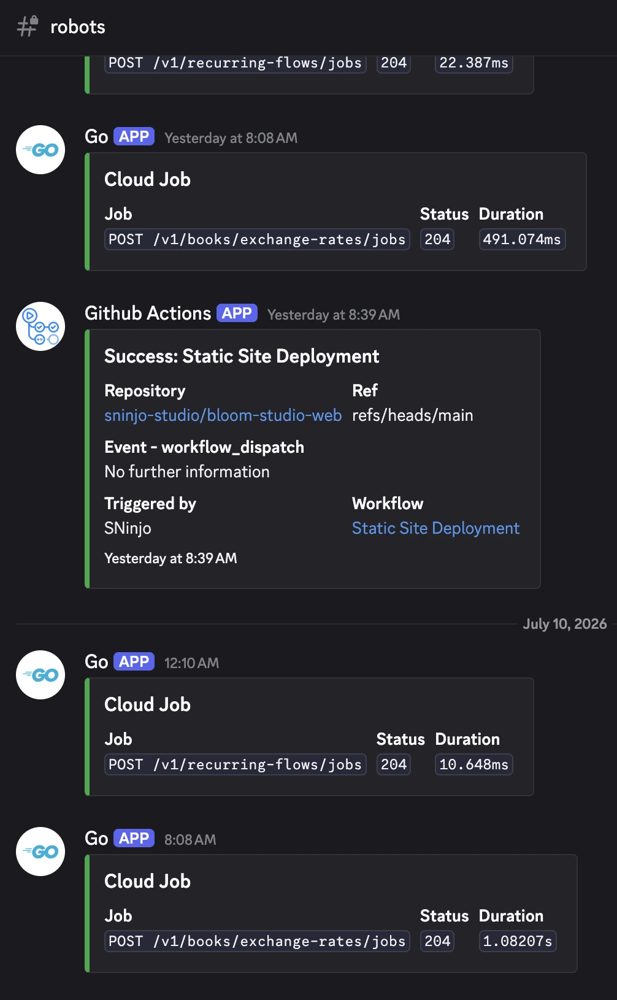
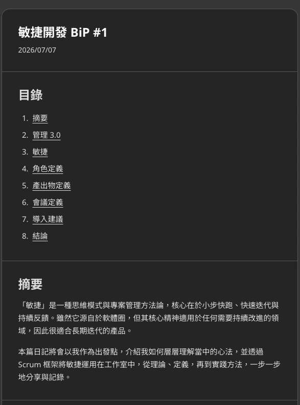
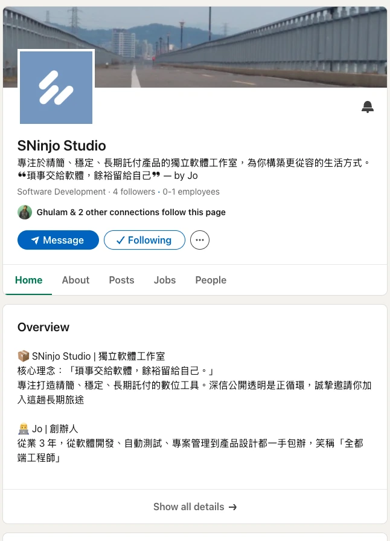

## 摘要

開發日期: 6/29 - 7/12  
與會人員: Jo (獨立開發)  
會議規劃:

- 站會: 每天早上 8.
- PBR: 6/28 (日)
- Sprint Planning: 6/29 (一) 8.
- Sprint Review: 7/10 (五) 8.
- Sprint Retro: 7/10 (五) 8.

## PBR 會議

Threads 貼文的投票結果：

- [1 票] 新手大禮包 (使用教學、專人資料搬移、推薦分析類別
- [0 票] 金流串接 (免費的 App 使用起來好可怕 🫠
- [1 票] 雲端發票同步

## Planning 會議

目標：

- ~~[SP: 5] 官網日記加上文章編輯、圖片上傳功能~~
- ❌ [SP: 2] 官網首頁文案更新
- ✅ [SP: 1] 撰寫各個社群媒體帳號的文案
- ✅ [SP: 2] 規劃週更文案的內容與電子報的分類
- ❌ [SP: 2] 撰寫 Keeper 設計概念的教學文章
- ~~[SP: 3] 設計與開發 Keeper App 內部的教學流程~~
- ❌ [SP: 1] 規劃 Keeper 專人資料轉移流程
- ✅ [SP: 1] Survey 雲端發票的串接方式與申請流程
- ✅ [SP: 3] 自動任務、重大錯誤 Discord 通報

7/07 臨時動議：

- ✅ [SP: 5] 重構官網日記的技術堆疊，以利 SEO
- ⭕ [SP: 5] 撰寫長文日記：敏捷開發、品牌故事、Keeper 設計理念
- ❌ [SP: 8] Keeper 轉移成網頁 PWA 版本

共完成 15 SP

## Review 會議

DEMO：

1. Discord 被動接收自動任務與重大錯誤通知
2. 官網日記釋出完整功能，包括 SEO、文章附件(圖片、表格)、文章上架 Pipeline
3. 撰寫[敏捷開發長文日記](../)
4. Linkedin, FB, X 社群帳號的基礎設定與文案撰寫

<ImageCarousel>

</ImageCarousel>

## Retro 會議

### 新問題討論

1. 日記技術評估錯誤，導致花費額外時間重構技術堆疊  
A. 評估時因為牽涉到工作流的急迫變更，導致研究時間過短，建議先開一張獨立的規劃 Ticket，並給出足夠的 SP 進行評估

2. 在衝刺過程中，突然有臨時動議改變部分原定計劃  
A. 只記錄不做任何行動。通常應避免衝刺中的目標改變，但這次是整體性的方向改變

3. 這週開發時，白天容易疲勞、精神沒有上週好  
A1. 睡眠狀況與品質下降，先嘗試避免睡前使用 3C、飲用咖啡因  
A2. 輸出類型主要是長文撰寫，耗費心力較多，可以嘗試安排開發任務在下午、晚上

### 舊問題復盤

1. Mobile 手動測試花太多時間，造成其他任務延遲  
A. 已無效，Keeper 將著重在網頁版本

2. 某幾天 DEV 任務太滿，造成 MKT 項目沒有完成  
A. 觀察中，仍有幾天是這個狀況

3. Threads 不適合做 Build in Public 企劃
4. 工作室需要電子名片，以利爾後參加活動時使用  
A. 已解決，已釋出相關功能至官網並融入工作流

5. 目前重大錯誤沒有警示的管道，需要人工定期檢查 Log  
A. 已解決，由 Discord 接收被動通知

## 站會記錄

記錄細節

### 2026-07-11 (Day 13)

昨天完成

- DEV
  - Sprint 3 收尾與總結
  - 初步規劃 Sprint 4 的事務
  - 移除後端遺留的文章 API 與 Schema
  - 新增回頂部的按鈕至日記頁面
- MKT
  - Threads 發文 #工作室日記
  - Threads 海巡

今天要做

- DEV
  - 修復日記 ImageCarousel 的鼠標與動畫 Bug
  - 規劃品牌故事的風格與設定
- MKT
  - Threads 發文
  - Threads 海巡

遇到困難

- N/A

### 2026-07-10 (Day 12)

昨天完成

- MKT
  - Threads 發文 #獨立開發 #一人創業
  - Threads 海巡

今天要做

- DEV
  - Sprint 3 收尾與總結
  - 初步規劃 Sprint 4 的事務
  - 移除後端遺留的文章 API 與 Schema
  - 規劃品牌故事的風格與設定
- MKT
  - Threads 發文
  - Threads 海巡

遇到困難

- N/A

### 2026-07-09 (Day 11)

昨天完成

- DEV
  - Survey 雲端發票的串接方式與申請流程
- MKT
  - Threads 發文 #獨立開發 #一人創業
  - Threads 海巡

今天要做

- DEV
  - 規劃品牌故事的風格與設定
  - 撰寫品牌故事的長文日記
- MKT
  - Threads 發文
  - Threads 海巡

遇到困難

- N/A

### 2026-07-08 (Day 10)

昨天完成

- DEV
  - 撰寫敏捷開發的介紹文
  - 微調日記頁面的版型
  - 釋出最新的日記頁面
- MKT
  - Threads 發文 #工作室日記

今天要做

- DEV
  - Survey 雲端發票的串接方式與申請流程
  - 撰寫品牌故事的長文日記
  - 規劃官網設計的美化方式與流程
- MKT
  - Threads 發文
  - Threads 海巡

遇到困難

- N/A

### 2026-07-07 (Day 9)

昨天完成

- DEV
  - 優化日記的版面與瀏覽功能
  - 建立日記的自動發布流程
- MKT
  - Threads 發文 #獨立開發
  - Threads 海巡

今天要做

- DEV
  - 撰寫敏捷開發的介紹文
  - 撰寫品牌與 Keeper 的介紹文
  - 美化官網根據品牌故事
- MKT
  - Threads 發文
  - Threads 海巡

遇到困難

- N/A

### 2026-07-06 (Day 8)

昨天完成

- DEV
  - 重構工作室日記的技術堆疊並優化 SEO
- MKT
  - Threads 發文 #AI Threads
  - Threads 海巡

今天要做

- DEV
  - 建立日記的自動發布流程
  - 撰寫敏捷開發的介紹文
  - 撰寫品牌與 Keeper 的介紹文
  - 美化官網根據品牌故事
- MKT
  - Threads 發文
  - Threads 海巡

遇到困難

- N/A

### 2026-07-05 (Day 7)

昨天完成

- DEV
  - 轉移文章至新的 Repo 中
- MKT
  - Threads 發文 #AllIsWell
  - Threads 海巡

今天要做

- DEV
  - 重構工作室日記的技術堆疊並優化 SEO
- MKT
  - Threads 發文
  - Threads 海巡

遇到困難

- N/A

### 2026-07-04 (Day 6)

昨天完成

- DEV
  - 分析優化工作室日記 SEO 的方式
  - 設計工作室日記圖片的上傳方式
- MKT
  - Threads 發文 #一人創業 #奇怪的知識增加了
  - Threads 海巡
  - 撰寫各個社群媒體帳號的文案
  - 規劃隔週更文案的內容與電子報的分類

今天要做

- DEV
  - 重構工作室日記的技術堆疊並優化 SEO
- MKT
  - Threads 發文
  - Threads 海巡

遇到困難

- N/A

### 2026-07-03 (Day 5)

昨天完成

- DEV
  - 觀察自動任務是否有正確回報結果至 Discord
  - 優化日記頁面的 CTA
- MKT
  - Threads 發文 #獨立開發 #工作室日記
  - Threads 海巡

今天要做

- DEV
  - 分析優化工作室日記 SEO 的方式
  - 設計工作室日記圖片的上傳方式
- MKT
  - Threads 發文
  - Threads 海巡
  - 撰寫各個社群媒體帳號的文案
  - 規劃週更文案的內容與電子報的分類

遇到困難

- N/A

### 2026-07-02 (Day 4)

昨天完成

- DEV
  - 檢查 purge 月度任務失敗原因
  - 串接自動任務、重大錯誤的訊息至 Discord
- MKT
  - Threads 發文 #一人創業
  - Threads 海巡

今天要做

- DEV
  - 觀察自動任務是否有正確回報結果至 Discord
  - 優化日記頁面的 CTA
  - 設計工作室日記圖片的上傳方式
- MKT
  - Threads 發文
  - Threads 海巡
  - 撰寫各個社群媒體帳號的文案
  - 規劃週更文案的內容與電子報的分類

遇到困難

- N/A

### 2026-07-01 (Day 3)

昨天完成

- DEV
  - 優化日記文章上架的流程
  - Threads 日記文章轉移至官網
  - 串接 CI/CD pipeline 的訊息至 Discord
- MKT
  - Threads 發文 #一人創業
  - Threads 海巡

今天要做

- DEV
  - 檢查 purge 月度任務失敗原因
  - 串接自動任務、重大錯誤的訊息至 Discord
- MKT
  - Threads 發文
  - Threads 海巡
  - 撰寫各個社群媒體帳號的文案
  - 規劃週更文案的內容與電子報的分類

遇到困難

- N/A

### 2026-06-30 (Day 2)

昨天完成

- DEV
  - 開發官網日記文章編輯功能
  - 優化官網文案與 UI/UX
- MKT
  - Threads 發文 #工作室日記
  - Threads 海巡

今天要做

- DEV
  - 優化日記文章上架的流程
  - Threads 日記文章轉移至官網
  - 串接自動任務、重大錯誤的訊息至 Discord
- MKT
  - Threads 發文
  - Threads 海巡

遇到困難

- N/A

### 2026-06-29 (Day 1)

昨天完成

- DEV
  - 開發官網文章的前端頁面
  - 釋出官網文章與電子名片頁面
- MKT
  - Threads 發布 工作室日記 貼文

今天要做

- DEV
  - 開發官網日記文章編輯功能
  - 開發官網日記圖片上傳功能
  - Threads 日記文章轉移至官網
- MKT
  - Threads 發布 工作室日記 貼文
  - Threads 去其他新貼文互動

遇到困難

- N/A

