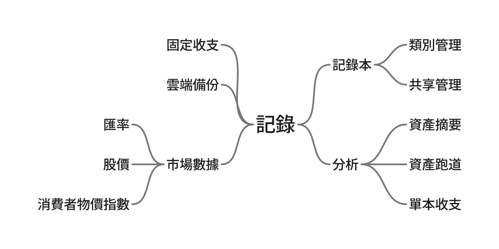
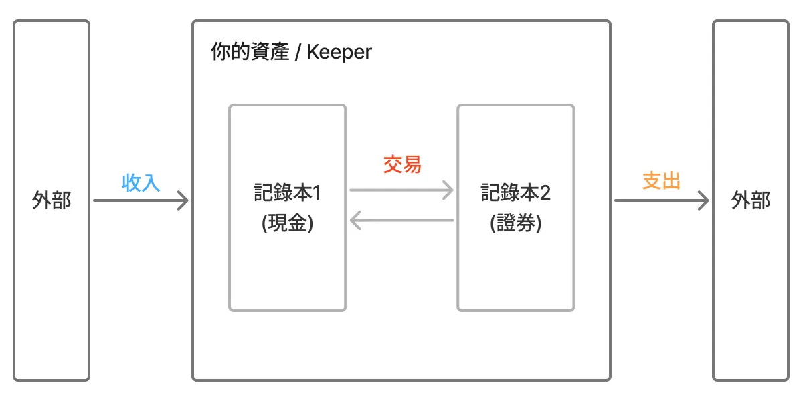
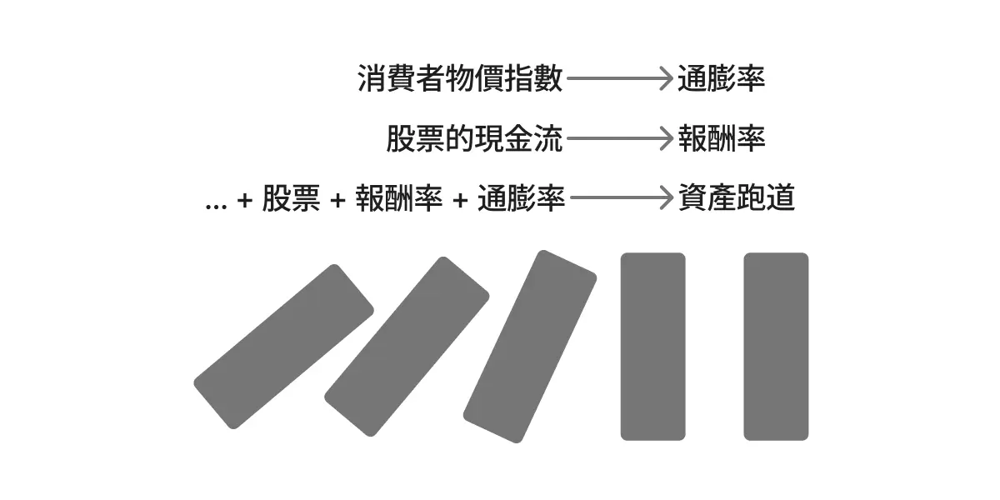

## 引言

在真正動手記帳之前，理解工具背後的設計思考與心智模型，能幫助我們更好地將軟體融入日常生活，而不是反被工具綁架。Keeper 在設計之初，便確立了三個核心原則：

## 先化繁為簡，再追求完整

我們很容易被琳瑯滿目的「功能清單」吸引，覺得功能越多、越貼近現實生活越好，但這會讓我們陷入學習曲線陡峭且使用情境過度複雜的窘境。
舉例來說，我看過一個 APP 除了基本的記帳外，包含債務、預算、信用卡、存錢筒等超過 8 種功能陳列在頁面中，除了眼花撩亂外，也不禁懷疑各個功能之間的整合性是否完整？

我認為這樣的功能堆疊反而會造成使用上的負擔，因為重點並非窮舉生活的情境，反而應該更目的導向地來設計架構。以 Keeper 為例，核心設計是「記錄」，也就是最基本的記帳功能，再圍繞此基礎來延伸出相關的功能，例如資產摘要、固定收支、市場數據...等功能。

這樣在維持功能簡潔且直覺的同時，也能滿足以「長期理財」為目標的深度需求 — 少而精。

## 以記錄為核心，整合多元資產形式

財務管理本質上是處理不同單位的數字轉換，例如 NT$1,500、0050 500 股、BTC 2 枚，再搭配現行價值與年化報酬率等數值，我們就可以求得符合自己投資策略的資產配置比例。
因此，Keeper 以「記錄」為核心，收納各種資產形式的單位與換算數值，例如現金&匯率、股票&股價等，來提供整合性的資產摘要功能。

在 Keeper 的設計哲學中，建議將我們的所有資產都收錄於當中的記錄本，並透過記錄來分別代表資產的流動動作，例如「收入」、「支出」與「交易」。

這樣的設計既保留使用彈性，也提供整合多元資產的結構 — 簡而巧。

## 回顧歷史，並推導未來的走向

目前市面上針對「長期財務規劃」或「財富自由試算」的服務大多都是從未來逆推回來的，意思是先設定生活的開銷目標，再反推需要準備的資金量，例如「4% 提領法則」便是其中廣為人知的例子。
這的確提供了一個簡單的方法，讓我們嘗試從更宏觀的角度來檢視自身的財務狀況，但同時也隱藏了許多的風險，例如忽略通貨膨脹、投資環境變化等時代因素。

因此，我更偏向「由過去的真實記錄，推導未來的可能性」的設計，這就像是由數據組成的骨牌，每一張都有自己的立足點，接著陸續由前一張推倒後一張，最後得到一個經過驗證的預測。

這樣由前往後推導的策略，雖然仍有一定的理論誤差，但提供更真實的參考依據 — 歸納法。

## 結語

Keeper 是以「長期理財」為目標，透過簡潔的核心元素「記錄」來整合多元資產形式，並由過去的真實數據推導未來的可能性。它不僅僅是一個記帳工具，更是一個陪伴使用者財務規劃的管家。
