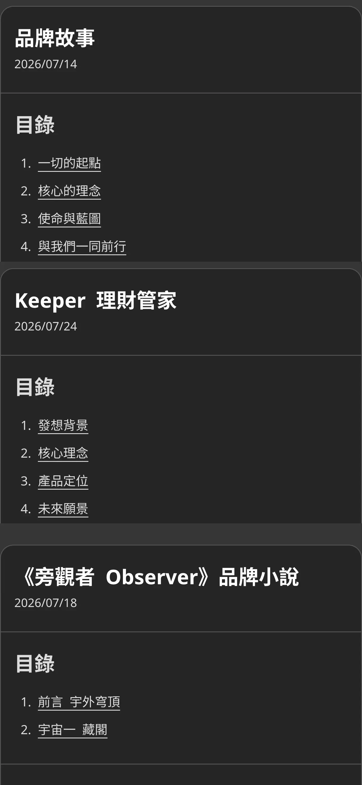
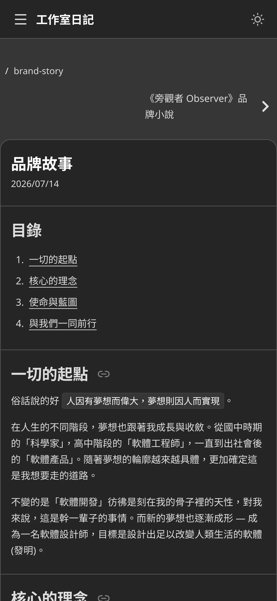

## 摘要

開發日期: 7/13 - 7/24  
與會人員: Jo (獨立開發)  
會議規劃:

- 站會: 每天早上 8.
- PBR: 7/12 (日)
- Sprint Planning: 7/13 (一) 8.
- Sprint Review: 7/24 (五) 8.
- Sprint Retro: 7/24 (五) 8.

## PBR 會議

Threads 貼文的投票結果：

- [1 票] 品牌故事 (Why & What)
- [1 票] Keeper 設計概念 (最終的願景)
- [0 票] 行銷策略 (過去經驗 & 現在規劃)

## Planning 會議

- ✅ [SP: 3] 撰寫品牌故事的長文日記
- ✅ [SP: 3] 撰寫品牌小說的長文日記
- ~~[SP: 3] 撰寫 Keeper 設計理念的長文日記~~
- ✅ [SP: 3] 撰寫 Keeper 產品介紹的長文日記
- ✅ [SP: 2] 優化工作室日記的瀏覽功能&體驗
- ✅ [SP: 5] 重構工作室官網的 Style 以符合故事背景
- ❌ [SP: 8] 轉移 Keeper 成網頁版本
- ✅ [SP: 1] 下架雙平台 Keeper App

共完成 17 SP

## Review 會議

DEMO：

1. 官網的所有頁面以宇宙為元素重構風格
2. 發佈品牌故事、品牌小說、Keeper 產品介紹的長文日記
3. 優化工作室日記的 UX

<ImageCarousel>

</ImageCarousel>

## Retro 會議

### 新問題討論

1. Threads 感覺被限流，觸及率明顯變低  
A. 推測是連續貼文附帶連結導致，未來盡量避免

1. Threads 目前經營有點無力感，因為沒有主要產品當作話題  
A. 維持日更但可以將重心放更多在海巡，接下來幾個 Sprint 專心衝刺 Keeper，且參加一些 Threads 的活動增廣見聞

1. 拖延隔週發電子報的任務
A. 這個週末發送第一封電子報，接下來就保持這個節奏

### 舊問題復盤

1. 某幾天 DEV 任務太滿，造成 MKT 項目沒有完成  
A. 觀察中，目前的整體節奏還不錯，但有幾天是 MKT 任務太多影響到 DEV 任務

1. 日記技術評估錯誤，導致花費額外時間重構技術堆疊  
A. 已解決，這次 Sprint 沒有再發生

1. 這週開發時，白天容易疲勞、精神沒有上週好  
A. 已解決  
A1. 睡眠狀況與品質下降，先嘗試避免睡前使用 3C、飲用咖啡因  
A2. 輸出類型主要是長文撰寫，耗費心力較多，可以嘗試安排開發任務在下午、晚上

1. Review 與 Retro 會議後的兩天定義上有點奇怪，因為 Sprint 算是結束了，但仍有任務在進行  
A. 已解決，將 Sprint 最後的週六與週日列入下一個 Sprint 當作開頭來準備事項，其他會議時間不變

## 站會記錄

記錄細節

### 2026-07-24 (Day 12)

昨天完成

- DEV
  - 重構 Theme 至瀏覽器端控管
  - 釋出新風格官網
  - 下架雙平台 Keeper App
- MKT
  - Threads 發文
  - Threads 海巡

今天要做

- DEV
  - 移除 User Appearance 相關的 API 實作
- MKT
  - 撰寫 Keeper 設計理念的長文日記
  - 總結 Sprint 4 的 Review & Retro 報告
  - Threads 發文 #工作室日記
  - Threads 海巡

遇到困難

- N/A

### 2026-07-23 (Day 11)

昨天完成

- DEV
  - 用新的風格與文案重構官網
    - Keeper page
    - Legal page
    - Contact page
- MKT
  - Threads 發文 #AI工作流
  - Threads 海巡

今天要做

- DEV
  - 重構 Theme 至瀏覽器端控管
  - 釋出新風格官網
  - 下架雙平台 Keeper App
- MKT
  - 撰寫 Keeper 設計理念的長文日記
  - Threads 發文
  - Threads 海巡

遇到困難

- N/A

### 2026-07-22 (Day 10)

昨天完成

- DEV
  - 用新的風格與文案重構官網
    - Journey page (card)
    - Product page
- MKT
  - Threads 發文 #AI工作流
  - Threads 海巡

今天要做

- DEV
  - 用新的風格與文案重構官網
    - Keeper page
    - Journal page
    - Account page
- MKT
  - Threads 發文
  - Threads 海巡

遇到困難

- N/A

### 2026-07-21 (Day 9)

昨天完成

- DEV
  - 用新的風格與文案重構官網
    - Landing page
- MKT
  - Threads 發文 #podcast
  - Threads 海巡

今天要做

- DEV
  - 用新的風格與文案重構官網
    - Card page
    - Product page
    - Journal page
    - Account page
- MKT
  - Threads 發文
  - Threads 海巡

遇到困難

- N/A

### 2026-07-20 (Day 8)

昨天完成

- DEV
  - 優化官網 Tailwind CSS 的配置
  - 設計官網的新風格
- MKT
  - Threads 發文 #節奏 #Clean Code
  - Threads 海巡

今天要做

- DEV
  - 用新的風格與文案重構官網
- MKT
  - Threads 發文
  - Threads 海巡

遇到困難

- N/A

### 2026-07-19 (Day 7)

昨天完成

- DEV
  - 重構官網改用 Tailwind CSS
- MKT
  - 微調 & 發佈品牌小說
  - Threads 發文 #AI
  - Threads 海巡

今天要做

- DEV
  - 優化官網 Tailwind CSS 的配置
  - 設計官網的新風格
- MKT
  - Threads 發文
  - Threads 海巡

遇到困難

- N/A

### 2026-07-18 (Day 6)

昨天完成

- MKT
  - 撰寫品牌小說的第一集故事
  - Threads 發文 #AIThreads
  - Threads 海巡

今天要做

- DEV
  - 重構官網改用 Tailwind CSS
  - 設計官網的新風格
- MKT
  - 微調 & 發佈品牌小說
  - Threads 發文
  - Threads 海巡

遇到困難

- N/A

### 2026-07-17 (Day 5)

昨天完成

- MKT
  - Threads 發文 #敏捷
  - Threads 海巡

今天要做

- MKT
  - 撰寫品牌小說的第一集故事
  - 繪製品牌小說前兩集的插畫
  - Threads 發文
  - Threads 海巡

遇到困難

- N/A

### 2026-07-16 (Day 4)

昨天完成

- DEV
  - 日記頁面加入標題連結複製與修復 hash 導向偏移問題
- MKT
  - Threads 發文 #一人創業
  - Threads 海巡

今天要做

- MKT
  - Threads 發文
  - Threads 海巡

遇到困難

- N/A

### 2026-07-15 (Day 3)

昨天完成

- MKT
  - 撰寫品牌小說的前言篇章
  - Threads 發文 #工作室日記 與 破百追蹤慶祝
  - Threads 海巡

今天要做

- DEV
  - 重構官網改用 Tailwind CSS
- MKT
  - 撰寫品牌小說的第一集故事
  - Threads 發文
  - Threads 海巡

遇到困難

- N/A

### 2026-07-14 (Day 2)

昨天完成

- MKT
  - 規劃品牌小說的篇章與結構
  - 撰寫品牌故事的長文日記
  - Threads 發文 #軟體圈 #奇怪的知識增加了
  - Threads 海巡

今天要做

- DEV
  - 撰寫品牌小說的長文日記
  - 重構官網改用 Tailwind CSS
- MKT
  - Threads 發文
  - Threads 海巡

遇到困難

- N/A

### 2026-07-13 (Day 1)

昨天完成

- MKT
  - 規劃品牌故事的風格與設定
  - 定義品牌小說的角色與世界觀
  - Threads 發文 #工作室日記
  - Threads 海巡

今天要做

- MKT
  - 規劃品牌小說的篇章與結構
  - 撰寫品牌故事的長文日記
  - Threads 發文
  - Threads 海巡

遇到困難

- N/A

