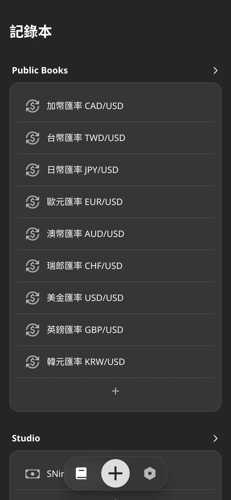
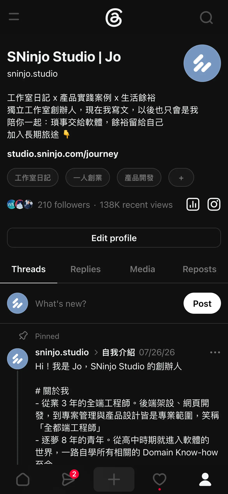
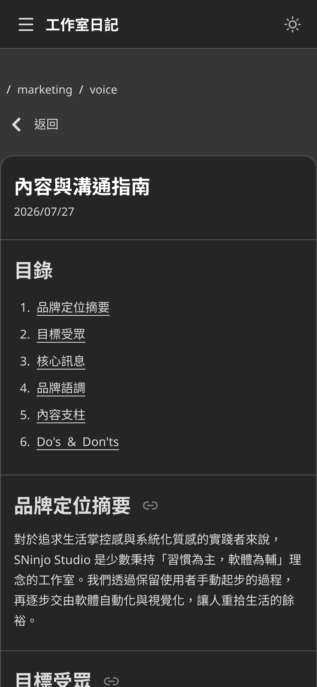

## 摘要

開發日期: 7/25 - 8/07  
與會人員: Jo (獨立開發)  
會議規劃:

- 站會: 每天早上 8.
- PBR: 不進行
- Sprint Planning: 7/27 (一) 8.
- Sprint Review: 8/07 (五) 8.
- Sprint Retro: 8/07 (五) 8.

## PBR 會議

N/A

## Planning 會議

- ✅ [SP: 8] 轉移 Keeper 成網頁版本
- ✅ [SP: 3] 撰寫日記《內容與溝通指南》
- ✅ [SP: 5] 按照指南調整 Threads 的風格與內容
- ⚠️ [SP: 3] 撰寫第一份電子報
- ✅ [SP: 2] 移除後端冗餘的 API 實作

共完成 18 SP（電子報會在下個 Sprint 預備期送出）

## Review 會議

DEMO：

1. 釋出 Keeper 網頁服務
2. 調整 Threads 的風格與內容
3. 撰寫日記《內容與溝通指南》

<ImageCarousel>

</ImageCarousel>

## Retro 會議

### 新問題討論

1. 前端開發現在會有重複的手動測試行為  
A. 先針對重要流程、邏輯複雜的元件撰寫自動測試

1. 過去的文案容易讓讀者失焦、沒有興趣  
A. 用於提升轉化的內容要站在讀者的角度去發想，提供具體的範例與見解

1. 某幾天將 MKT 任務排在晚上，但是 DEV 任務延誤，導致任務品質下降  
A. 統一早上完成 MKT 任務，不要為了展示產出而打亂整體節奏

### 舊問題復盤

1. Threads 感覺被限流，觸及率明顯變低  
A. 已解決，目前限流已解除，但未來要測試更好的轉換方式

1. Threads 目前經營有點無力感，因為沒有主要產品當作話題  
A. 觀察中，維持日更但將重心放在海巡，接下來幾個 Sprint 專心衝刺 Keeper

1. 拖延隔週發電子報的任務
A. 觀察中，這個週末發送第一封電子報，接下來就保持這個節奏

1. 某幾天 DEV 任務太滿，造成 MKT 項目沒有完成  
A. 已解決，目前整體任務排程的節奏不錯

## 站會記錄

記錄細節

### 2026-08-07 (Day 12)

昨天完成

- DEV
  - 優化官網的 RWD
- MKT
  - 調整部分日記的文案
  - Threads 發文
  - Threads 海巡

今天要做

- ALL
  - 總結 Sprint 5 的 Review & Retro 報告
- DEV
  - 實作 Keeper RWD & PWA
- MKT
  - Threads 發文
  - Threads 海巡

遇到困難

- N/A

### 2026-08-06 (Day 11)

昨天完成

- MKT
  - 調整部分日記與 Journey 頁面的文案
  - Threads 發文
  - Threads 海巡

今天要做

- DEV
  - 實作 Keeper RWD & PWA
- MKT
  - 調整部分日記的文案
  - Threads 發文
  - Threads 海巡

遇到困難

- N/A

### 2026-08-05 (Day 10)

昨天完成

- DEV
  - 更換資料庫中的 icon set 資料
  - 移除後端冗餘的 API 實作
- MKT
  - 調整官網的文案
  - Threads 發文
  - Threads 海巡

今天要做

- DEV
  - 實作 Keeper RWD & PWA
- MKT
  - 調整部分日記與 Journey 頁面的文案
  - Threads 發文
  - Threads 海巡

遇到困難

- N/A

### 2026-08-04 (Day 9)

昨天完成

- DEV
  - 轉移 Keeper 功能至網頁版
    - 記錄本編輯頁面
    - 記錄編輯頁面
  - 釋出 Keeper BETA 版
  - 後端更換前端用到的 icon set
- MKT
  - Threads 發文
  - Threads 海巡

今天要做

- DEV
  - 更換資料庫中的 icon set 資料
  - 移除後端冗餘的 API 實作
  - 實作 Keeper RWD & PWA
- MKT
  - 調整部分日記與官網的文案
  - Threads 發文
  - Threads 海巡

遇到困難

- N/A

### 2026-08-03 (Day 8)

昨天完成

- DEV
  - 轉移 Keeper 功能至網頁版
    - 記錄本編輯頁面
    - 記錄編輯頁面
- MKT
  - 參加台北AI沙龍第四場
  - Threads 發文
  - Threads 海巡

今天要做

- DEV
  - 轉移 Keeper 功能至網頁版
    - 記錄本編輯頁面
    - 記錄編輯頁面
  - 釋出 Keeper BETA 版
- MKT
  - Threads 發文
  - Threads 海巡

遇到困難

- N/A

### 2026-08-02 (Day 7)

昨天完成

- DEV
  - 實作官網 PWA
- MKT
  - 參加台北AI沙龍第四場
  - Threads 發文
  - Threads 海巡

今天要做

- DEV
  - 轉移 Keeper 功能至網頁版
    - 記錄本頁面
    - 群組編輯頁面
    - 記錄本編輯頁面
    - 記錄編輯頁面
  - 釋出 Keeper BETA 版
- MKT
  - Threads 發文
  - Threads 海巡

遇到困難

- N/A

### 2026-08-01 (Day 6)

昨天完成

- DEV
  - 轉移 Keeper 功能至網頁版
    - 記帳本頁面
- MKT
  - Threads 發文
  - Threads 海巡

今天要做

- DEV
  - 實作官網 PWA
- MKT
  - 參加台北AI沙龍第四場
  - Threads 發文
  - Threads 海巡

遇到困難

- N/A

### 2026-07-31 (Day 5)

昨天完成

- DEV
  - 轉移 Keeper 功能至網頁版
    - 總覽頁面
- MKT
  - Threads 發文
  - Threads 海巡

今天要做

- DEV
  - 轉移 Keeper 功能至網頁版
    - 記帳本頁面
  - 實作 Keeper 響應式網頁
- MKT
  - Threads 發文
  - Threads 海巡

遇到困難

- N/A

### 2026-07-30 (Day 4)

昨天完成

- DEV
  - 優化登入串接方式
  - 針對 WebApplication 優化 SEO
  - 轉移 Keeper 功能至網頁版
    - 設定頁面
- MKT
  - Threads 發文
  - Threads 海巡

今天要做

- DEV
  - 轉移 Keeper 功能至網頁版
    - 總覽頁面
    - 記帳本頁面
- MKT
  - Threads 發文
  - Threads 海巡

遇到困難

- N/A

### 2026-07-29 (Day 3)

昨天完成

- DEV
  - 設計 Keeper 網頁的 UI/UX
  - 轉移 Keeper 功能至網頁版
    - 登入頁面串接
- MKT
  - Threads 發文 #東野圭吾
  - Threads 海巡

今天要做

- DEV
  - 轉移 Keeper 功能至網頁版
    - 設定頁面
    - 總覽頁面
    - 記帳本頁面
- MKT
  - Threads 發文
  - Threads 海巡

遇到困難

- N/A

### 2026-07-28 (Day 2)

昨天完成

- DEV
  - 規劃 Keeper 搬移 Web 的事項
  - 重構 Keeper 主要架構至新的 Repo
- MKT
  - Threads 發文 #一人創業
  - Threads 海巡

今天要做

- DEV
  - 設計 Keeper 網頁的 UI/UX
  - 轉移 Keeper 功能至網頁版
    - 設定頁面
    - 記帳本頁面
- MKT
  - Threads 發文
  - Threads 海巡

遇到困難

- N/A

### 2026-07-27 (Day 1)

昨天完成

- MKT
  - 撰寫內容與溝通指南
  - 優化 Threads Profile
  - Threads 發文 #自我介紹
  - Threads 海巡

今天要做

- DEV
  - 規劃 Keeper 搬移 Web 的事項
  - 重構 Keeper 主要架構至新的 Repo
- MKT
  - Threads 發文
  - Threads 海巡

遇到困難

- N/A

### 2026-07-26 (Day 0)

昨天完成

- ALL
  - 初步規劃 Sprint 5 的任務
- MKT
  - Threads 發文
  - Threads 海巡

今天要做

- MKT
  - 撰寫內容與溝通指南
  - 優化 Threads Profile
  - 撰寫電子報
  - Threads 發文
  - Threads 海巡

遇到困難

- N/A

### 2026-07-25 (Day -1)

昨天完成

- DEV
  - 修正官網部分用色與文案
- MKT
  - 撰寫 Keeper 設計理念的長文日記
  - 總結 Sprint 4 的 Review & Retro 報告
  - Threads 發文 #工作室日記
  - Threads 海巡

今天要做

- ALL
  - 初步規劃 Sprint 5 的任務
- DEV
  - 移除 User Appearance 相關的 API 實作
- MKT
  - 撰寫電子報
  - Threads 發文
  - Threads 海巡

遇到困難

- N/A

