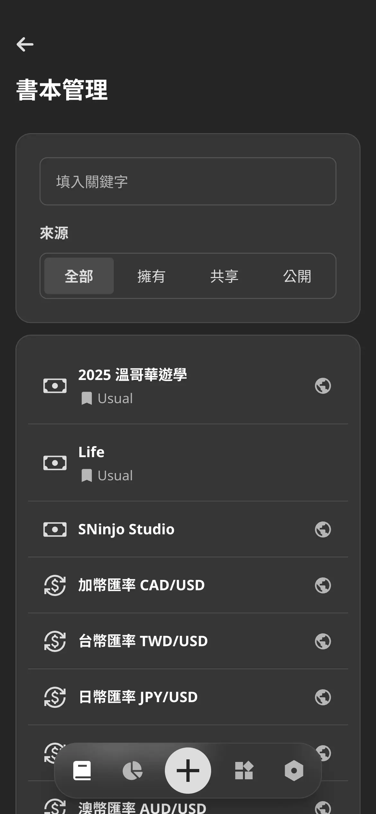
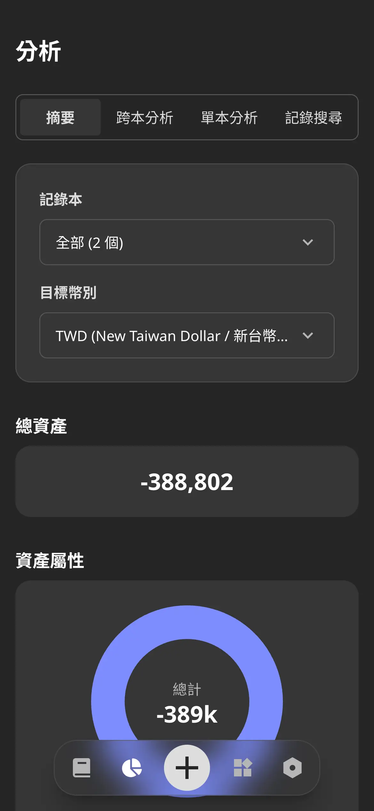
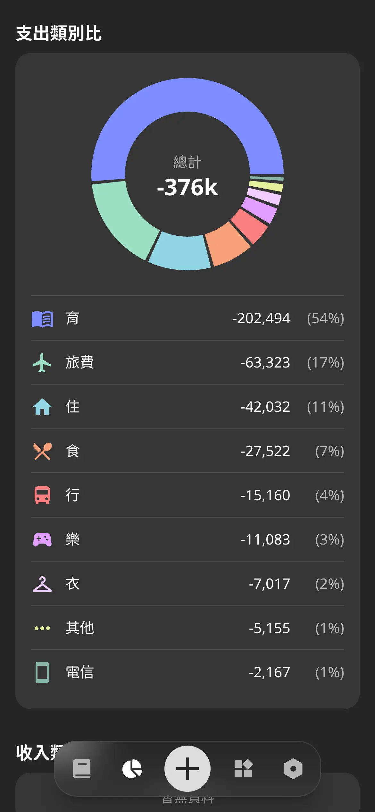

## 摘要

開發日期: 8/08 - 8/21  
與會人員: Jo (獨立開發)  
會議規劃:

- 站會: 每天早上 8.
- PBR: 不進行
- Sprint Planning: 8/10 (一) 8.
- Sprint Review: 8/21 (五) 8.
- Sprint Retro: 8/21 (五) 8.

## PBR 會議

N/A

## Planning 會議

Keeper：

- ✅ [SP: 3] 優化 Input 元件的 UX
- ✅ [SP: 3] 實作分析頁面，包含資產摘要、跨本分析、單本分析、記錄搜尋
- ✅ [SP: 3] 實作管理頁面，包含書本管理、資料備份、固定收支
- ✅ [SP: 5] 重新設計 Category
- ✅ [SP: 2] 匯入加拿大遊學的數據至公開記錄本
- ✅ [SP: 2] 調查股價的串接方式

共完成 18 SP

## Review 會議

DEMO：

1. 實作分析頁面
2. 實作管理頁面
3. 匯入加拿大遊學的數據至公開記錄本

<ImageCarousel>

</ImageCarousel>

## Retro 會議

### 新問題討論

1. Threads 目前經營的有點無力，主題定位尚未定案  
A. 下週約脆友交流，討論後再定調，目前維持每天海巡

1. 開發上，有發現很多 UX 提升的空間，需要整體的設計調整  
A. 已記錄至 Trello 票卡，之後排進 Sprint 中消化

### 舊問題復盤

1. 前端開發現在會有重複的手動測試行為  
A. 觀察中，目前僅針對複雜邏輯撰寫單元測試

1. 過去的文案容易讓讀者失焦、沒有興趣  
A. 已改善，將文案從使用者角度重新撰寫，成效待觀察

1. 某幾天將 MKT 任務排在晚上，但是 DEV 任務延誤，導致任務品質下降  
A. 已解決，統一早上完成 MKT 任務

1. 拖延隔週發電子報的任務  
A. 觀察中，這週末暫停一次

## 站會記錄

記錄細節

### 2026-08-21 (Day 12)

昨天完成

- DEV
  - 配合 Category 新設計調整網頁
- MKT
  - Threads 海巡

今天要做

- ALL
  - 總結 Sprint 6 的 Review & Retro 報告
- MKT
  - 匯入加拿大遊學的數據至公開記錄本
  - 匯入自己的財務資料
  - Threads 海巡

遇到困難

- N/A

### 2026-08-20 (Day 11)

昨天完成

- DEV
  - 設計股票的實作方式
  - 移除 Fee record 的 API 實作
  - 配合 Category 新設計調整 API
- MKT
  - Threads 海巡

今天要做

- DEV
  - 配合 Category 新設計調整網頁
- MKT
  - 匯入加拿大遊學的數據至公開記錄本
  - Threads 海巡

遇到困難

- N/A

### 2026-08-19 (Day 10)

昨天完成

- DEV
  - 重新定位 Keeper
  - 重新設計 Category
- MKT
  - Threads 海巡

今天要做

- DEV
  - 更改 Category 的使用邏輯
  - 設計股票的實作方式
- MKT
  - 匯入加拿大遊學的數據至公開記錄本
  - Threads 發文
  - Threads 海巡

遇到困難

- N/A

### 2026-08-18 (Day 9)

昨天完成

- DEV
  - 調查股價的串接方式
  - 修復 Analysis 子頁面切換 Bug
- MKT
  - Threads 海巡

今天要做

- DEV
  - 重新定位 Keeper
  - 重新設計 Category
- MKT
  - Threads 海巡

遇到困難

- N/A

### 2026-08-17 (Day 8)

昨天完成

- DEV
  - 實作書本管理頁面與相關權限功能
- MKT
  - Threads 海巡

今天要做

- DEV
  - 調查股價的串接方式
- MKT
  - 匯入加拿大遊學的數據至公開記錄本
  - Threads 海巡

遇到困難

- N/A

### 2026-08-16 (Day 7)

昨天完成

- MKT
  - 參加 LinkedIn 小聚
  - Threads 海巡

今天要做

- DEV
  - 實作書本管理頁面與相關權限功能
  - 調查股價的串接方式
- MKT
  - Threads 海巡

遇到困難

- N/A

### 2026-08-15 (Day 6)

昨天完成

- MKT
  - Threads 帳號定位，規劃發文內容與更新 Profile
  - Threads 發文
  - Threads 海巡

今天要做

- DEV
  - 實作書本管理頁面與相關權限功能
- MKT
  - 參加 LinkedIn 小聚
  - Threads 海巡

遇到困難

- N/A

### 2026-08-14 (Day 5)

昨天完成

- DEV
  - 實作管理頁面，包含資料備份、固定收支
- MKT
  - Threads 發文
  - Threads 海巡

今天要做

- DEV
  - 實作書本管理頁面與相關權限功能
  - 設計 Keeper 未來的藍圖
- MKT
  - Threads 帳號定位
  - Threads 發文
  - Threads 海巡

遇到困難

- N/A

### 2026-08-13 (Day 4)

昨天完成

- DEV
  - 實作分析頁面，包含資產摘要、跨本分析、單本分析、記錄搜尋
- MKT
  - Threads 發文
  - Threads 海巡

今天要做

- DEV
  - 實作管理頁面，包含書本管理、資料備份、固定收支
- MKT
  - Threads 發文
  - Threads 海巡

遇到困難

- N/A

### 2026-08-12 (Day 3)

昨天完成

- DEV
  - 實作 Date Input 元件
  - 實作記錄本的分析 Tab
- MKT
  - Threads 發文
  - Threads 海巡

今天要做

- DEV
  - 實作分析頁面，包含資產摘要、跨本分析、單本分析、記錄搜尋
- MKT
  - Threads 發文
  - Threads 海巡

遇到困難

- N/A

### 2026-08-11 (Day 2)

昨天完成

- DEV
  - 同步官網的 style 配置
  - 優化 Keeper Input 元件的 UX
- MKT
  - Threads 發文
  - Threads 海巡

今天要做

- DEV
  - 實作 Date Input 元件
  - 實作分析頁面
- MKT
  - Threads 發文
  - Threads 海巡

遇到困難

- N/A

### 2026-08-10 (Day 1)

昨天完成

- DEV
  - 優化 Input 元件的 UX
- MKT
  - 發出電子報 #1
  - 各個社群平台發文
  - Threads 發文
  - Threads 海巡

今天要做

- DEV
  - 同步官網的 style 配置
  - 優化 Keeper Input 元件的 UX
- MKT
  - Threads 發文
  - Threads 海巡

遇到困難

- N/A

### 2026-08-09 (Day 0)

昨天完成

- ALL
  - 初步規劃 Sprint 6 的任務
- MKT
  - Threads 發文
  - Threads 海巡

今天要做

- DEV
  - 優化 Input 元件的 UX
- MKT
  - 發出電子報 #1
  - 各個社群平台發文
  - Threads 發文
  - Threads 海巡

遇到困難

- N/A

### 2026-08-08 (Day -1)

昨天完成

- ALL
  - 總結 Sprint 5 的 Review & Retro 報告
- DEV
  - 實作 Keeper RWD & PWA
- MKT
  - Threads 發文
  - Threads 海巡

今天要做

- ALL
  - 初步規劃 Sprint 6 的任務
- MKT
  - Threads 發文
  - Threads 海巡

遇到困難

- N/A

