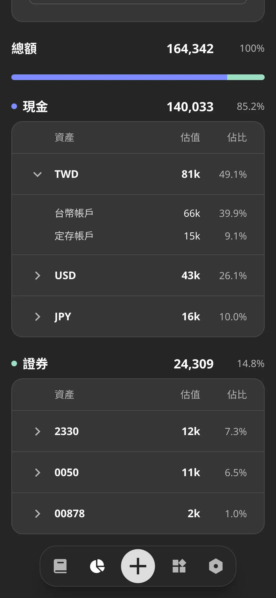
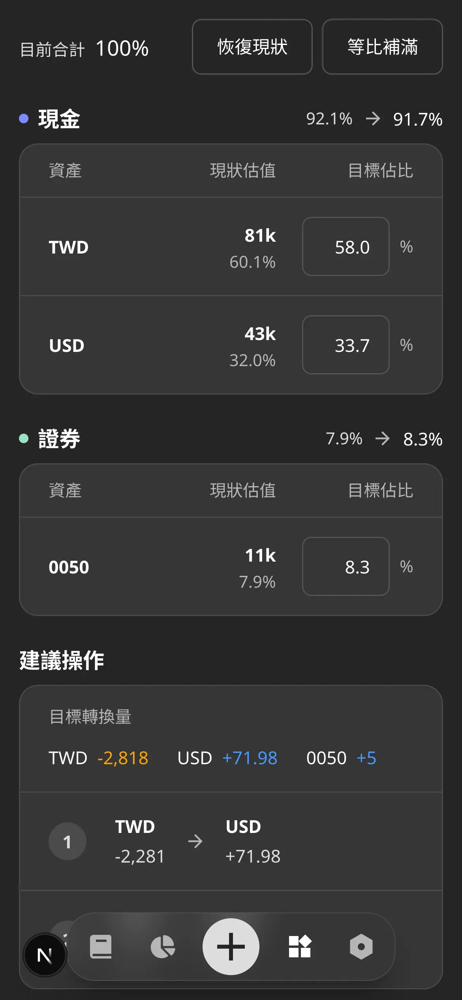
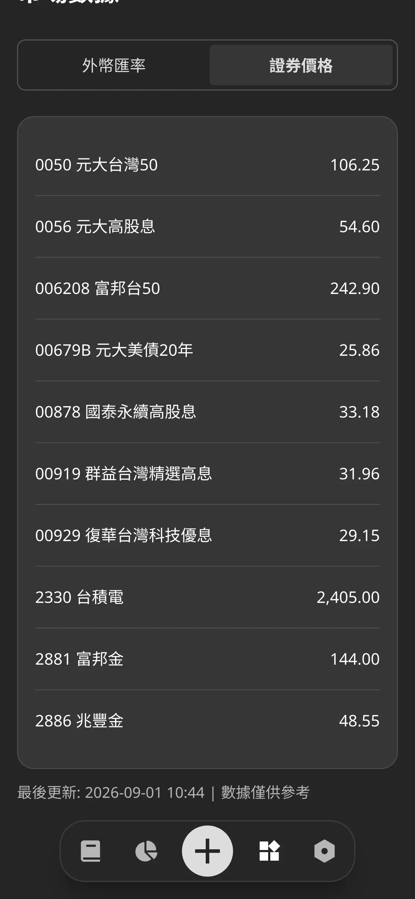

## 摘要

開發日期: 8/22 - 9/04  
與會人員: Jo (獨立開發)  
會議規劃:

- 站會: 每天早上 8.
- PBR: 不進行
- Sprint Planning: 8/24 (一) 8.
- Sprint Review: 9/04 (五) 8.
- Sprint Retro: 9/04 (五) 8.

## PBR 會議

N/A

## Planning 會議

Keeper：

- ✅ [SP: 5] 串接股票 API
- ✅ [SP: 2] 加上月中匯率的移除機制，只保留月底數據
- ~~[SP: 3] 彙整 10 檔股票 2020 年後的月收盤價~~
- ~~[SP: 3] 彙整 9 個貨幣 2020 年後的月底數據~~
- ✅ [SP: 3] 實作匯率與股價的即時數據頁面
- ✅ [SP: 2] 補上數據邊界的錯誤訊息至分析頁面
- ✅ [SP: 2] 設計資產配比的功能

9/02 臨時動議：

- ✅ [SP: 5] 實作資產摘要與資產配比頁面

共完成 19 SP

## Review 會議

DEMO：

1. 實作市場數據 (匯率/ 股價) 頁面
2. 實作資產摘要頁面
3. 實作資產配比頁面

<ImageCarousel>

</ImageCarousel>

## Retro 會議

### 新問題討論

1. 已經設定好的 Sprint 目標變更  
A. 將所有大小目標開設在 Trello 並進行 Ticket 化的管理，避免變更

### 舊問題復盤

1. Threads 目前經營的有點無力，主題定位尚未定案  
A. 維持每天海巡，並嘗試將河道刷成目標受眾感興趣的內容，另外以衝刺產品 MVP 為優先

1. 前端開發現在會有重複的手動測試行為  
A. 觀察中，目前僅針對複雜邏輯撰寫單元測試

1. 拖延隔週發電子報的任務  
A. 觀察中，這週末按計劃發送一封電子報

## 站會記錄

記錄細節

### 2026-09-04 (Day 12)

昨天完成

- MKT
  - Threads 發文
  - Threads 海巡

今天要做

- ALL
  - 總結 Sprint 7 的 Review & Retro 報告
  - 初步規劃 Sprint 8 的任務
- DEV
  - 開發資產配比的工具頁面
  - 整理 TODO List
- MKT
  - Threads 海巡

遇到困難

- N/A

### 2026-09-03 (Day 11)

昨天完成

- DEV
  - 開發資產摘要的分析頁面
- MKT
  - Threads 發文
  - Threads 海巡

今天要做

- DEV
  - 開發資產配比的工具頁面
- MKT
  - Threads 發文
  - Threads 海巡

遇到困難

- N/A

### 2026-09-02 (Day 10)

昨天完成

- DEV
  - 設計資產配比的功能
- MKT
  - 整理工作室的固定開支

今天要做

- DEV
  - 開發資產摘要的分析頁面
  - 開發資產配比的工具頁面
- MKT
  - Threads 發文
  - Threads 海巡

遇到困難

- N/A

### 2026-09-01 (Day 9)

昨天完成

- DEV
  - recurring flow 加上「每年」頻率
  - 實作匯率與股價的即時數據頁面

今天要做

- DEV
  - 設計資產配比的功能
- MKT
  - 整理工作室的固定開支
  - Threads 海巡

遇到困難

- N/A

### 2026-08-31 (Day 8)

昨天完成

- DEV
  - 跨本分析加入股票計算
  - 前端加上股票邏輯
- MKT
  - Threads 海巡

今天要做

- DEV
  - recurring flow 加上「每年」頻率
  - 實作匯率與股價的即時數據頁面
- MKT
  - 整理工作室的固定開支
  - Threads 海巡

遇到困難

- N/A

### 2026-08-30 (Day 7)

昨天完成

- DEV
  - 調整 Unit API 配合前端需求

今天要做

- DEV
  - 跨本分析加入股票計算
  - 前端加上股票邏輯
- MKT
  - 整理工作室的固定開支
  - Threads 海巡

遇到困難

- N/A

### 2026-08-29 (Day 6)

昨天完成

- DEV
  - 串接股票 API

今天要做

- DEV
  - 跨本分析加入股票計算
  - 調整 Unit API 配合前端需求
  - 前端加上股票邏輯
- MKT
  - 整理工作室的固定開支
  - Threads 海巡

遇到困難

- N/A

### 2026-08-28 (Day 5)

昨天完成

- N/A

今天要做

- DEV
  - 串接股票 API
- MKT
  - 整理工作室的固定開支
  - Threads 海巡

遇到困難

- N/A

### 2026-08-27 (Day 4)

病假

### 2026-08-26 (Day 3)

病假

### 2026-08-25 (Day 2)

昨天完成

- DEV
  - 加上月中匯率的移除機制，只保留月底數據
  - 優化 Keeper 的 Radio 按鈕 RWD
- MKT
  - Threads 海巡

今天要做

- DEV
  - 重新設計 Keeper 記錄編輯頁面
  - 補上數據邊界的錯誤訊息至分析頁面
  - 串接股票 API
- MKT
  - Threads 海巡

遇到困難

- N/A

### 2026-08-24 (Day 1)

昨天完成

- N/A

今天要做

- DEV
  - 加上月中匯率的移除機制，只保留月底數據
  - 串接股票 API
- MKT
  - Threads 海巡

遇到困難

- N/A

### 2026-08-23 (Day 0)

休假

### 2026-08-22 (Day -1)

休假

