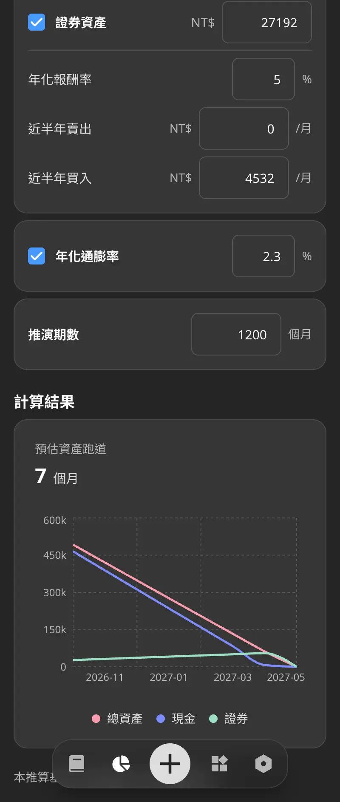
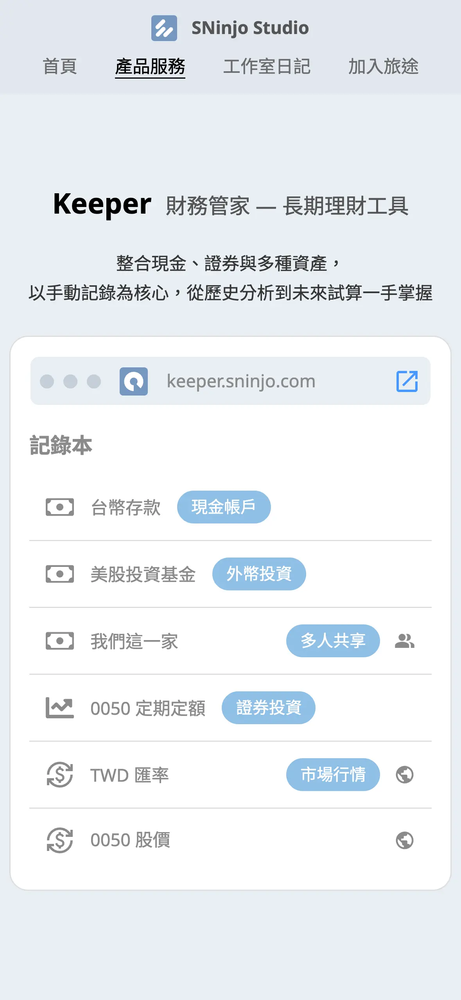
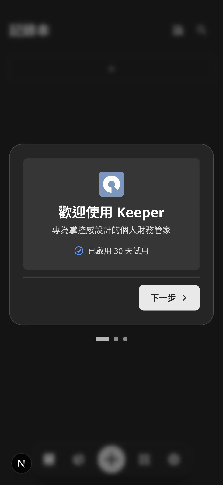
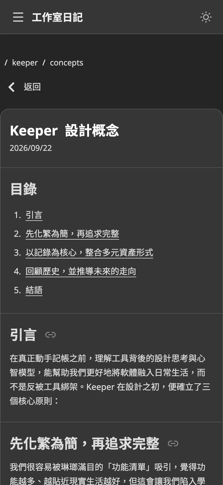

## 摘要

開發日期: 9/19 - 10/02  
與會人員: Jo (獨立開發)  
會議規劃:

- 站會: 每天早上 9.
- PBR: 不進行
- Sprint Planning: 9/21 (一) 9.
- Sprint Review: 10/02 (五) 9.
- Sprint Retro: 10/02 (五) 9.

## PBR 會議

N/A

## Planning 會議

Keeper：

- ✅ [SP: 5] 實作 Onboarding 流程
- ❌ [SP: 3] 實作基礎功能教學
- ✅ [SP: 3] 撰寫《設計概念》
- ~~[SP: 5] 實作 App, Email 通知功能~~
- ✅ [SP: 3] 創辦新的社群媒體帳號，並更新官網資訊
- ✅ [SP: 1] 釋出 Keeper v1.0

10/02 更新：

- ✅ [SP: 3] 實作 Email 通知功能

共完成 15 SP

## Review 會議

DEMO（包含上個 Sprint 的內容）：

1. 資產跑道頁面
2. 產品訂閱頁面
3. Keeper 介紹頁面
4. Onboarding 流程
5. 《設計概念》日記

<ImageCarousel>

</ImageCarousel>

## Retro 會議

### 新問題討論

1. 對於行銷沒有經驗，需要時間摸索  
A. 目前規劃下一季會提高行銷投入比例，但保留一定的開發節奏

### 舊問題復盤

1. Threads 帳號被封鎖，且無從申訴  
A. 已解決，創建新的帳號並以 Jo 的個人身份運營

1. 綠界、統一金流皆無法申請「信用卡 Token 扣款服務」  
A. 已解決，改回串接綠界的「信用卡定期定額」，並保留未來擴展的彈性

1. 已經設定好的 Sprint 目標變更  
A. 已解決，透過 Trello Tickets 管理大小任務，並做整體性的規劃

1. 前端開發現在會有重複的手動測試行為  
A. 觀察中，目前僅針對複雜邏輯撰寫單元測試，之後提高覆蓋率

1. 拖延隔週發電子報的任務  
A. 觀察中，持續按計劃發送隔週電子報

## 站會記錄

記錄細節

### 2026-10-02 (Day 12)

昨天完成

- DEV
  - AWS SES 申請移出 Sandbox
  - 修復記錄本備份 Bug
- MKT
  - Threads 海巡
  - Threads 發文
  - 設計短影音製作的風格、方式

今天要做

- ALL
  - 總結 Sprint 9 的 Review & Retro 報告
  - 初步規劃 Sprint 10 的任務
- MKT
  - Threads 海巡
  - 製作 Keeper 介紹短片

遇到困難

- N/A

### 2026-10-01 (Day 11)

昨天完成

- DEV
  - 優化 Keeper 的記錄流程
- MKT
  - 將自己的資產匯入 Keeper
  - Threads 海巡

今天要做

- DEV
  - AWS SES 申請移出 Sandbox
  - 修復記錄本備份 Bug
- MKT
  - Threads 海巡
  - Threads 發文
  - 設計短影音製作的風格、方式
  - 製作 Keeper 介紹短片

遇到困難

- N/A

### 2026-09-30 (Day 10)

昨天完成

- DEV
  - 修正 Runway API 的無資產計算 Bug
  - 修正 Purge Job 的外鍵衝突 Bug
- MKT
  - 初步規劃行銷計畫

今天要做

- MKT
  - 將自己的資產匯入 Keeper
  - 設計短影音製作的風格、方式

遇到困難

- N/A

### 2026-09-29 (Day 9)

昨天完成

- DEV
  - 修正 ECPay Merchant ID
  - 設定頁面加上試用期與訂閱的 Banner
  - 分析頁面修正手機版 Breadcrumb 的顯示邏輯
  - 記錄本頁面在 Library icon 加上共享邀請的通知效果

今天要做

- DEV
  - 串接 AWS SES 寄信功能
- MKT
  - 初步規劃行銷計畫

遇到困難

- N/A

### 2026-09-28 (Day 8)

昨天完成

- DEV
  - 新增 Category 預設選項
  - 實作 Admin 產品權限
  - 釋出 Keeper v1.0

今天要做

- DEV
  - 修正 ECPay Merchant ID
  - 串接 AWS SES 寄信功能
- MKT
  - 初步規劃行銷計畫

遇到困難

- N/A

### 2026-09-27 (Day 7)

昨天完成

- DEV
  - 開發試用期逾期 Email 通知功能

今天要做

- DEV
  - 新增 Category 預設選項
  - 實作 Admin 產品權限
  - 釋出 Keeper v1.0
- MKT
  - 初步規劃行銷計畫

遇到困難

- N/A

### 2026-09-26 (Day 6)

昨天完成

- N/A

今天要做

- DEV
  - 開發試用期逾期 Email 通知功能
  - 新增 Category 預設選項

遇到困難

- N/A

### 2026-09-25 (Day 5)

昨天完成

- DEV
  - 排查 docker compose 的轉址 Bug
  - 盤點需要 Email 通知的情境

今天要做

- DEV
  - 開發試用期逾期 Email 通知功能
  - 新增 Category 預設選項

遇到困難

- N/A

### 2026-09-24 (Day 4)

昨天完成

- DEV
  - 實作 Onboarding 流程

今天要做

- DEV
  - 排查 docker compose 的轉址 Bug
  - 盤點需要 Email 通知的情境

遇到困難

- N/A

### 2026-09-23 (Day 3)

昨天完成

- DEV
  - 設計 Onboarding 流程
  - 開發 Onboarding API
- MKT
  - Threads 海巡
  - 撰寫《Keeper 設計概念》

今天要做

- DEV
  - 實作 Onboarding 流程
  - 設計功能教學流程
- MKT
  - Threads 海巡

遇到困難

- N/A

### 2026-09-22 (Day 2)

昨天完成

- DEV
  - 官網更新社群媒體連結資訊
- MKT
  - 創辦新的社群媒體帳號
  - 初步規劃行銷的內容方向與頻率

今天要做

- DEV
  - 設計 Onboarding 流程
  - 開發 Onboarding API
- MKT
  - Threads 海巡
  - 撰寫《Keeper 設計概念》

遇到困難

- N/A

### 2026-09-21 (Day 1)

昨天完成

- ALL
  - 初步規劃 Sprint 9 的任務
- DEV
  - 新增權限驗證至 Keeper
- MKT
  - 行銷計劃初步規劃

今天要做

- DEV
  - 官網更新社群媒體連結資訊
- MKT
  - 創辦新的社群媒體帳號
  - 初步規劃行銷的內容方向與頻率

遇到困難

- N/A

### 2026-09-20 (Day 0)

昨天完成

- ALL
  - 總結 Sprint 8 的 Review & Retro 報告
- DEV
  - 優化 billing API 的格式
  - 開發帳單頁面至帳號中心

今天要做

- ALL
  - 初步規劃 Sprint 9 的任務
- DEV
  - 新增權限驗證至 Keeper
- MKT
  - 行銷計劃初步規劃

遇到困難

- N/A

### 2026-09-19 (Day -1)

昨天完成

- DEV
  - 開發訂閱頁面至帳號中心

今天要做

- ALL
  - 總結 Sprint 8 的 Review & Retro 報告
- DEV
  - 優化 billing API 的格式
  - 開發帳單頁面至帳號中心
  - 新增權限驗證至 Keeper

遇到困難

- N/A

