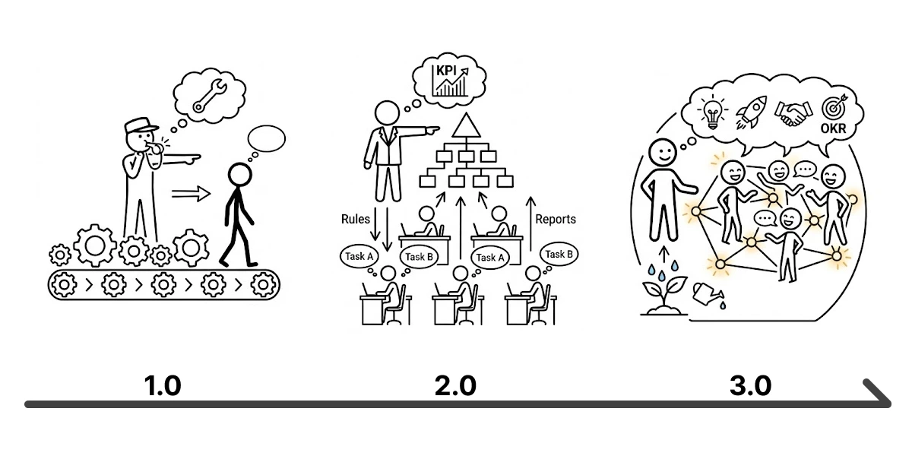
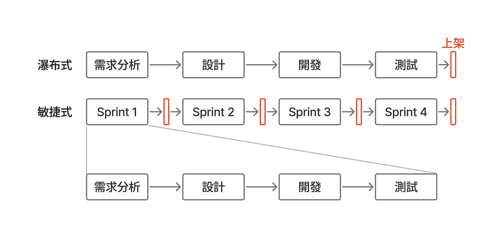
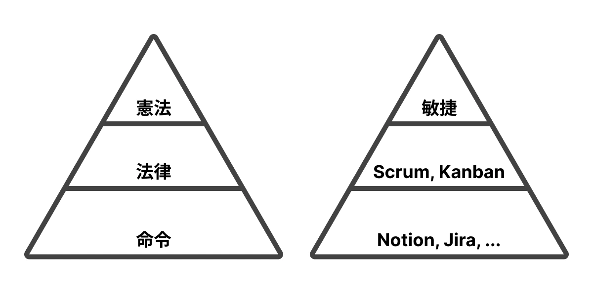
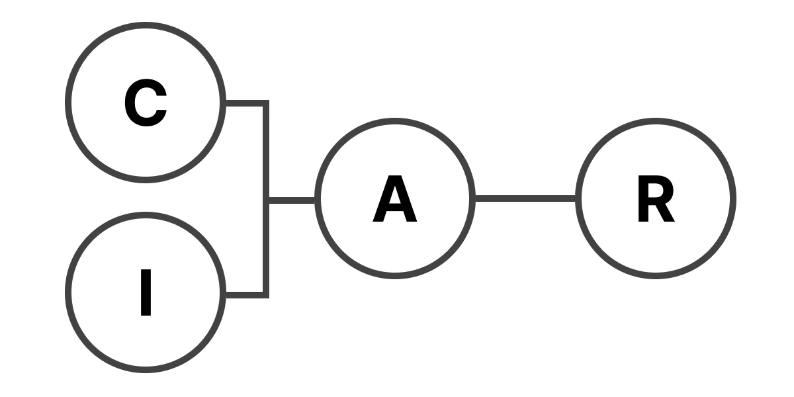
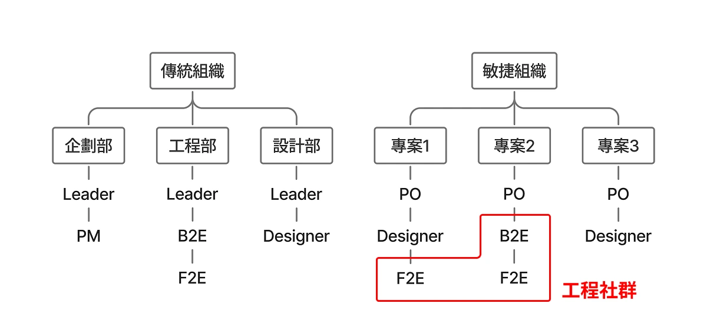
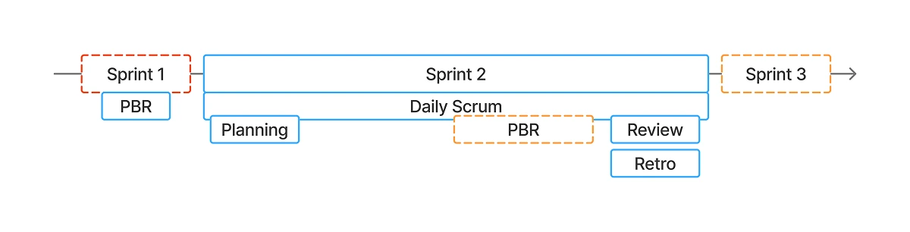

## 摘要

「敏捷」是一種思維模式與專案管理方法論，核心在於小步快跑、快速迭代與持續反饋。雖然它源自於軟體圈，但其核心精神適用於任何需要持續改進的領域，因此很適合長期迭代的產品。

本篇日記將會以我作為出發點，介紹我如何層層理解當中的心法，並透過 Scrum 框架將敏捷運用在工作室中，從理論、定義，再到實踐方法，一步一步地分享與記錄。

## 管理 3.0

隨著不同時代的演進，會根據當時的環境、產業趨勢，以及人們的思維模式，演變出不同的管理範式 (Management Paradigm)。

| 範式 | 時代 | 主要精神 | 衍生方法論 |
| --- | --- | --- | --- |
| 管理 1.0 | 工業革命 | 科學管理、效率至上 | 泰勒制 (Taylorism)、動時碼研究、生產流水線 SOP |
| 管理 2.0 | 戰後、大規模生產 | 績效驅動、科層組織 | 目標管理（MBO）、KPI（關鍵績效指標）、矩陣式組織 |
| 管理 3.0 | 資訊革命 | 複雜系統、團隊賦能 | 敏捷管理（Agile / Scrum）、OKR（目標與關鍵結果）、僕人式領導 |

其中管理 3.0 強調 `組織是一個複雜的生態系，人是核心，管理者是園丁`  
白話來說，過去的管理方式偏向斯巴達式的管理，注重紀律與控制；而管理 3.0 則更重視環境、系統的優化，讓團隊能夠更自主地工作，目的是共創組織與人才雙贏的局面，激發員工的潛能與熱情。

## 敏捷

### 專案開發模型

有兩個最常拿來比較的模型，分別是適合於短期、流程固定的 Waterfall (瀑布式)，以及適合於需求多變、長期迭代的 Agile (敏捷式)。

| 項目 | 敏捷式 (Agile) | 瀑布式 (Waterfall) |
| --- | --- | --- |
| 執行方式 | 小步快跑、快速迭代、持續反饋 | 先全部規劃，再一次性交付 |
| 變更彈性 | 高（可每週調整方向） | 低（變更代價高） |
| 客戶參與 | 持續溝通回饋 | 多半只有在初期與最後 |
| 風險控制 | 提早發現問題、可即時調整 | 問題常在後期才爆發 |

敏捷的概念其實很簡單，將一大包要交付的專案，拆散進每一個 Sprint 當作短期衝刺，並且在每次 Sprint 的結尾交付「可執行的結果」，快速地向市場進行概念驗證。

### 敏捷心法

敏捷 (Agile) 本質上是「心態與價值觀」。這也是為什麼敏捷聽起來很空，因為需要自己去堆砌實踐的框架與流程。

講到敏捷就必須提到 2001 年的[敏捷軟體開發宣言](https://agilemanifesto.org/iso/zhcht/manifesto.html)，其中最核心的四大價值，
本質上都在強調彈性與人本，這與管理 3.0 的核心精神不謀而合。

但誠如所見，它只是一個高層次的心法，實務上會套用不同的方法論，例如 Scrum、Kanban 等。
我喜歡用法律位階原則（Hierarchy of Laws）來解釋，敏捷對應的是高層次的憲法，其下會有不同的法律，例如 Scrum、Kanban 等，最後仍須根據組織的現況與需求，融入適合的管理工具與做法，進而制定出屬於自己的實踐方案。

## 角色定義

### ARCI 法則

在帶入 Scrum 角色前，先談談在專案管理廣為應用的 ARCI 法則，能有助於釐清每個團隊成員的責任和參與程度。

| 角色 | 說明 |
| --- | --- |
| Accountable（負責）| 對結果負最終責任，一人負責 |
| Responsible（執行）| 負責執行任務，可有多人參與 |
| Consulted（諮詢）| 提供意見與建議，需事先諮詢 |
| Informed（告知）| 需被告知進度，單向資訊流動 |

如同在專案中最重要的角色是 PM，在這個法則中我覺得最精華且最重要的設計是 A (Accountable)，必須指派一個人負責。而這個人要能遊刃於決策層，充分了解利益關係與執行方向並回報最終成果；同時要能指揮執行層，安排明確任務、驗收成果並給予真實回饋。除了要將決策層與執行層隔開外，也是溝通的橋樑，是建立團隊互信的關鍵。

### Scrum 角色

這是以常見軟體公司的情境進行的樣板設計。

其中容易有爭議的部分是「主管」，到底如何定義？我的建議是「能獨立完成成員日常任務的主管」視為 R；反之，當作高階主管是 C。
站在產品管理的角度，優先以 Product Owner (A) 做整體全面性的規劃，
高階主管 (C) 的意見會由他 (A) 統一彙整消化後，再交給各個小主管 (R) 帶領執行。

| 角色 | 職位 | ARCI | 說明 |
| --- | --- | --- | --- |
| Product Owner (PO) | PM | A | 決定產品的規劃、為產品的成敗負責、擺平利害關係人 |
| Scrum Master (SM) | 敏捷教練 | C, R | 確保 Scrum 被了解與實行，幫助每個人改變互動來最大化團隊價值，主要是管理系統與環境 |
| Development Team  (Dev Team) | 設計師、工程師 | R | 可以獨立完成任務的團隊，每個人都有自己的特長，但依任務需求自行安排工作內容 |
| Stakeholder | 老闆、高階主管 | C, I | 提供產品方向與業務需求，關注交付成果與價值，並對產品目標與資源配置有最終影響力 |

`Development Team` 不只是傳統意義上的工程開發團隊，更偏向於「專案」或「產品」開發，所有實質執行專案的人都列入。
因為敏捷主張「讓團隊圍繞著『價值 / 產品』而建，而不是圍繞著『技能』而建」。
而打散功能型部門，改以產品為核心成立跨職能團隊，這是為了降低部門層層傳遞造成的溝通成本、交接浪費（Handover waste），並激發團隊主動性。

同時，為了避免成員找不到同領域的人討論，技術能力可能會面臨停滯或孤立，業界著名的解法是雙軌制的組織設計，將各領域的成員再以專業領域劃分成特殊的社群關係，達成「縱向作戰、橫向交流」的平衡。

在敏捷實務中，最經典的黃金人數公式是 7 ± 2 人，因為溝通成本會隨著人數呈指數性的成長，更何況包含了多元的角色。但正因如此，有機會讓成員學習不同的視角與專業，進一步消弭跨部門的隔閡與偏見。

## 產出物定義

在執行 Scrum 的過程中會產生這些東西，建議要透過專業工具來管理，例如 Jira, Notion，這也是團隊量能量化的關鍵資料。

Backlog 通常分別由 Product Owner 整理出 Product Backlog，而 Development Team 則會產出 Sprint Backlog。
而 Ticket 又可再細分為 User Story, Task 等不同類型，但最終都是以票卡的形式進行管理。

其中我特別列出 Debt 的原因是這是很多團隊會忽略掉的部分，但往往會影響到團隊的長期發展，必須要記錄下來定期檢視並分配時間還債。

| 產出物 | 說明 |
| --- | --- |
| 票卡 Ticket | 顆粒度最小的單位，用於記錄、追蹤與管理可交付的工作項目。Ticket 可以代表一個功能需求、一個錯誤修復、一個設計任務 |
| 待辦清單 Backlog | 由 Ticket 組成的待辦清單，依照價值、重要性來訂定優先序，通常分為 Product 或 Sprint Backlog |
| 產品增量 Increment | 每次 Sprint 結束時，交付給利害關係人的可交付成果 |
| 債務 Debt | 在開發過程中，因追求速度而犧牲品質所產生的債務，會影響未來的開發效率 |

### Story Point

Story Point (SP) 是衡量 Ticket 難易度的單位，用來評估完成一個 User Story 所需的「相對 effort（努力程度）」。它並非以工時為基礎，而是結合了「複雜度、工作量、未知風險」等多個因素的綜合評估。

敏捷主張的是，與其評估不穩定、可能虛報的絕對工時，不如依靠相對的數字來計算團隊量能，並以此安排每次 Sprint 的負荷。認知心理學也已經證實，人類對於「絕對數值」的估算能力非常糟糕，但對於「相對大小」的直覺卻異常精準。

而估算 Story Point 的方法普遍使用 Planning Poker，透過團隊成員的集體討論與投票，在短時間內達成共識。但正因為其相對的性質並且要達成共識，需要時間培養團隊的默契，會隨著時間與經驗越估越接近真實的情況。

| 點數 | 說明 | 範例 |
| --- | --- | --- |
| 0 | 幾乎沒有工作量，或純溝通型任務 | 修改錯字、更新 Jira 標籤、送出簡單通知 |
| 1 | 非常小的任務，已知、單一角色完成 | 修改一行程式碼、設計稿文字微調 |
| 2 | 小任務，幾乎無需討論，單一角色獨立處理 | 製作一個靜態 UI 元件、API 加一個欄位 |
| 3 | 小任務，但可能有跨角色配合，或需少量對齊 | 設計一張新頁面、串接現有 API |
| 5 | 中等任務，有些不確定性，涉及 2+ 角色協作 | 新增註冊流程（含驗證、API 串接） |
| 8 | 複雜任務，多方協作、有不確定性或外部依賴 | 社群登入整合（OAuth + 註冊流程 + 設計）、後台報表分析頁（含多篩選、多視覺元件）|
| 13 | 非常大、風險高、不確定多，建議切分 | 完整會員系統（註冊 / 登入 / 綁定 / 移除）、多語系改版（FE + 文案 + 設計） |

## 會議定義

在敏捷中，以 Sprint 當作時間量尺，通常是 2-4 週。而週期內要交付可執行的結果，包含以下五個會議。

從會議內容可以了解到這是針對交付端的流程，至於 PO 與 Stakeholder 的討論必須在 PBR 前彙整完成，並落實記錄成一張張的 Ticket 以利會議進行。
而這樣的流程設計，預留了針對新 Ticket 的討論時間，避免不緊急的任務干擾 Dev Team 的衝刺，但同時也提早預告並討論未來的各項規劃。

| 會議 | 參加角色 | 說明 |
| --- | --- | --- |
| Daily Scrum  (Standup, 站會) | Dev Team, SM | 讓 Developer 互相同步進度、提早發現阻礙與風險，保持對 Sprint 目標的對齊 |
| Product Backlog  Refinement (PBR) | Dev Team, SM, PO | 針對近 1-2 Sprint 可能納入的 Ticket 進行討論，並初估可行性與 Story Point |
| Sprint Planning | Dev Team, SM, PO | 團隊決定這個 Sprint 可交付的 Ticket，正式拆解為可執行的任務，並明確分派給 Developer |
| Sprint Review | Dev Team, SM, PO, Stakeholder | 透過可交付的產出向 Stakeholder 展示成果，蒐集回饋並確認方向。通常建議不準備 PPT，直接操作產品以取得真實的反應 |
| Sprint Retrospective  (Retro) | Dev Team, SM, PO | 團隊在完成 Sprint 後進行檢視，檢討流程與方法的不足，包含 Debt，並制定可執行的改善行動 |

### 站會

每天早上進行 15min 的快速進度報告，為了提升效率，應全程站著執行。通常會問這三個問題：

| 問題 | 目的 | 說明 |
| --- | --- | --- |
| 昨天我完成什麼 | 團隊同步 | 分享進度，讓其他人知道任務完成度與依賴狀態 |
| 今天我要做什麼 | 調整協作 | 讓大家知道你今天的重點，便於支援或協作 |
| 有遇到什麼阻礙 | 發現問題 | 最重要！任何阻礙都應立刻浮上台面，由 SM 協助解決 |

## 導入建議

對於流程變更的保守派，建議諮詢有經驗的敏捷教練與專家，來評估組織導入敏捷的必要性與成效。很多組織現在仍是採用半敏捷的流程，認真來說，能找到適合的方法論來解決問題才是最重要的。

對於決絕的導入者，談敏捷如同是塑造團隊文化。最有效的改革是在招募與尋找合作夥伴時，就將「敏捷心態」作為首要考量。透過前期的短期合作（如一個 Sprint）快速磨合，提早確認彼此在不確定性中的默契與適任度，而非等到組織龐大後才進行痛苦的調整。

## 結論

狹義來說，敏捷是一套心法；廣義來說，敏捷是專案開發流程的方法論。不變的是其核心精神適用於長期迭代的產品。但也正是如此，它上升到了組織文化的層次，可能只有當所有團隊內的人都願意相信的那一刻，敏捷才真的成功落地。

### 為什麼我選擇敏捷

1. 對於長期迭代的產品來說，敏捷是目前業界最成熟、最有架構的支持體系
2. Scrum 的流程很適合 Build in Public 的企劃，對我來說大家就是 Stakeholder
3. 貼合工作室理念，以「人本」為價值的產品服務還得由「人本」的開發流程來創造
4. 符合新世代 (Gen Z) 的工作價值觀，未來尋找潛在的合作夥伴比較容易

### Murmur

有時候會突發奇想，如果我能在自已的工作室跑這種充滿理論 & 理想的敏捷的話，是不是大家也可以呢？

在這篇底下的子文章會記錄工作室真實的敏捷開發產出，歡迎大家一起加入長期迭代的旅途。如果有任何問題或是想要許願的文章主題、產品服務歡迎聯繫我，當然小小交流一下也可以喔！
