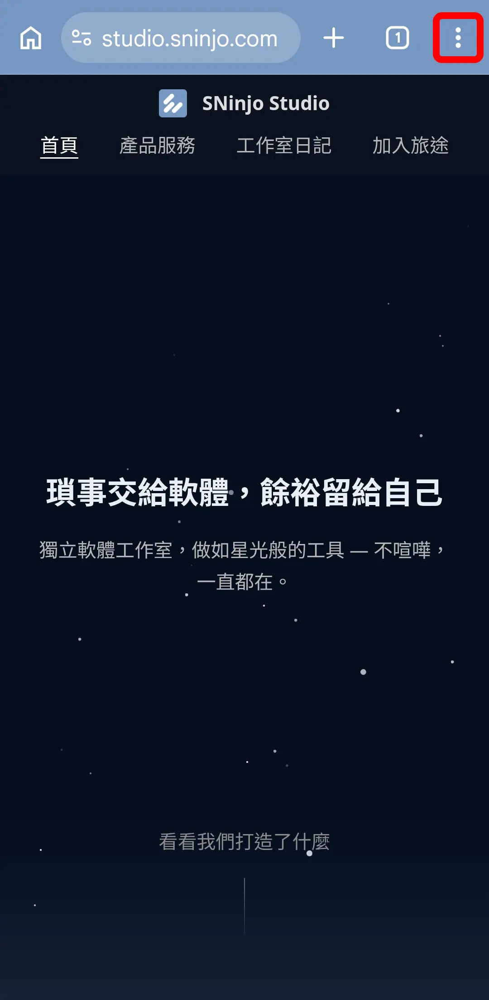
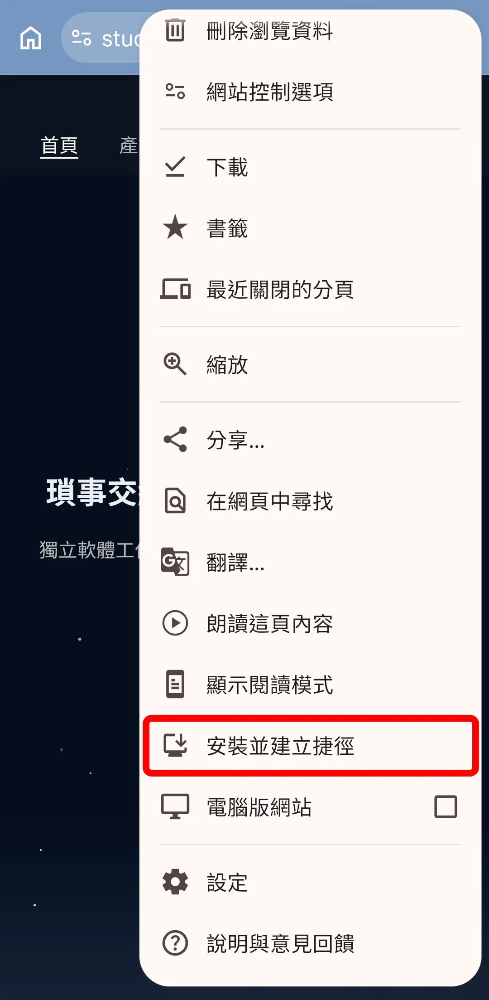
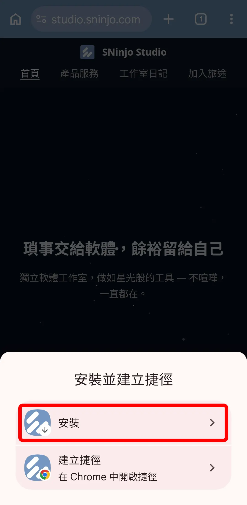
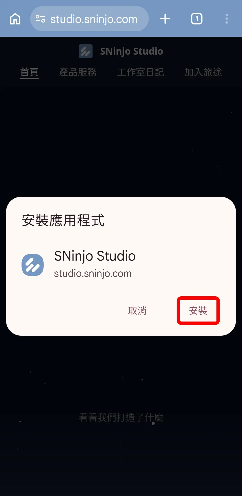
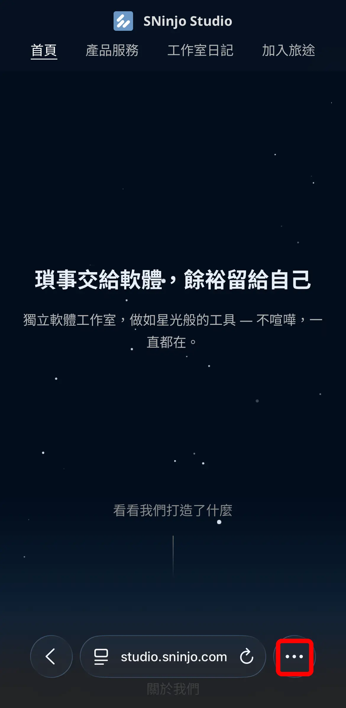
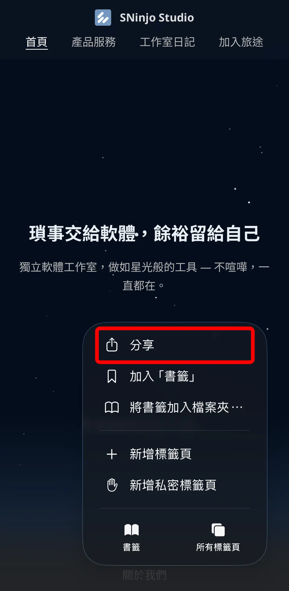
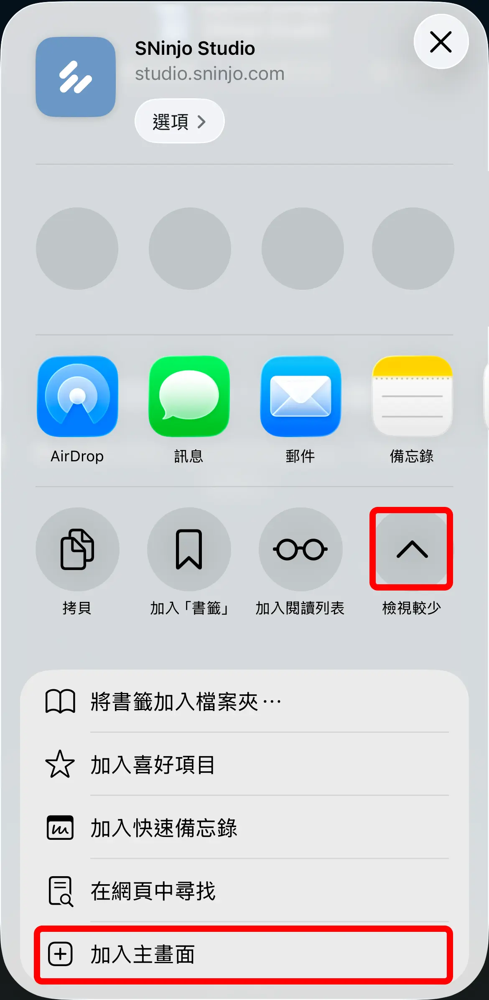
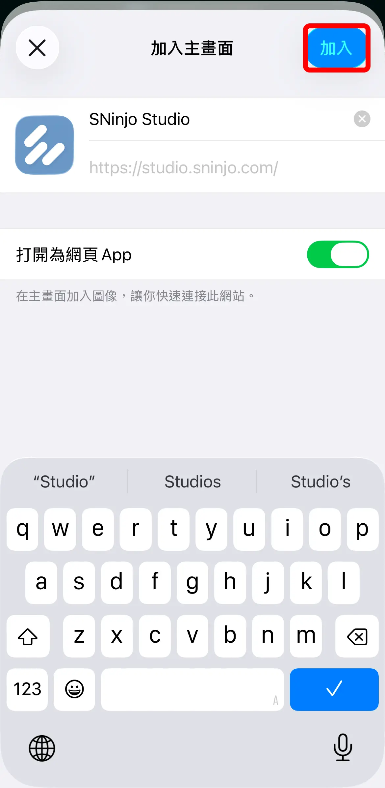

## 透過 Chrome 安裝 Web App

步驟：

1. 在 Chrome 瀏覽器開啟 Keeper 網頁後，點擊網址列右方的「更多選項（三個直點）」圖示。
2. 在彈出的選單中，點選「安裝並建立捷徑」選項。
3. 點選「安裝」應用程式選項。
4. 點選「安裝」，Web App 即成功安裝至手機桌面。

<ImageCarousel>

</ImageCarousel>

## 透過 Safari 安裝 Web App

步驟：

1. 在 Safari 瀏覽器開啟 Keeper 網頁後，點擊網址列右方的「更多選項（三個圓點）」圖示。
2. 在彈出的選單中，點選「分享」功能。
3. 點擊展開更多選項後，點選「加入主畫面」。
4. 點擊「加入」，Web App 即成功安裝至手機桌面。

<ImageCarousel>

</ImageCarousel>
